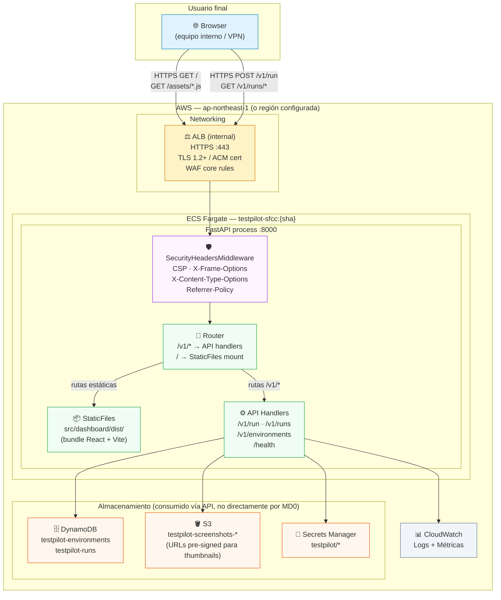
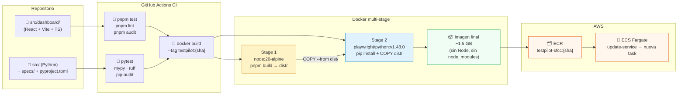
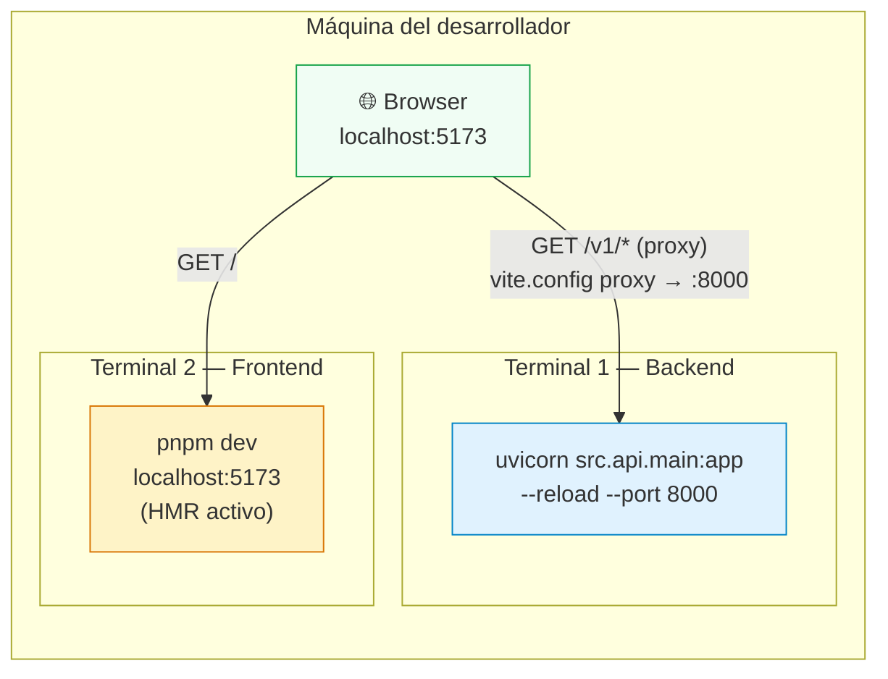

# Deployment Architecture — MD0 Dashboard Web Interno (2026-05-28)

MD0 no introduce servicios AWS propios — se despliega como archivos estáticos dentro del mismo proceso FastAPI del ECS task de U4. Este diagrama muestra los dos entornos: desarrollo local y producción en ECS Fargate.

---

## Diagrama — Producción (ECS Fargate)



---

## Diagrama — Build Pipeline (CI/CD)



---

## Diagrama — Desarrollo local



---

## Routing en FastAPI — orden de resolución

```
Request entrante
│
├── /v1/*           → API handlers (incluidos antes del mount estático)
├── /health         → health check endpoint
├── /               → index.html (SPA entry point)
├── /assets/*.js    → bundle JS/CSS
├── /assets/*.css   → estilos
└── /cualquier-ruta → fallback a index.html (SPA client-side routing)
```

El orden de registro en `main.py` es crítico: los routers `/v1/` se registran **antes** del `StaticFiles` mount para que las rutas de API tengan prioridad sobre el fallback HTML.

---

## Headers de seguridad aplicados (SecurityHeadersMiddleware)

| Header | Valor | Protege contra |
|---|---|---|
| `Content-Security-Policy` | `default-src 'self'; img-src 'self' data: https://*.s3.amazonaws.com; script-src 'self'; style-src 'self' 'unsafe-inline'; connect-src 'self'` | XSS, data injection |
| `X-Content-Type-Options` | `nosniff` | MIME sniffing |
| `X-Frame-Options` | `DENY` | Clickjacking |
| `Referrer-Policy` | `strict-origin-when-cross-origin` | Referrer leakage |

Headers aplicados solo a respuestas HTML (`/` y `*.html`). Las respuestas `/v1/*` JSON no los necesitan.

---

## Notas de despliegue

| Aspecto | Decisión |
|---|---|
| ¿MD0 usa servicios AWS propios? | No — comparte el ECS task de U4 |
| ¿Hay CDN (CloudFront)? | No en MVP — acceso interno via ALB + VPN suficiente |
| ¿Source maps en producción? | No (`sourcemap: false` en vite.config.ts — SECURITY-09) |
| ¿API key expuesta al cliente? | No — se ingresa en runtime via `sessionStorage`, no en build |
| ¿Variables de entorno en build? | No — todas las URLs son relativas (`/v1/...`) |
