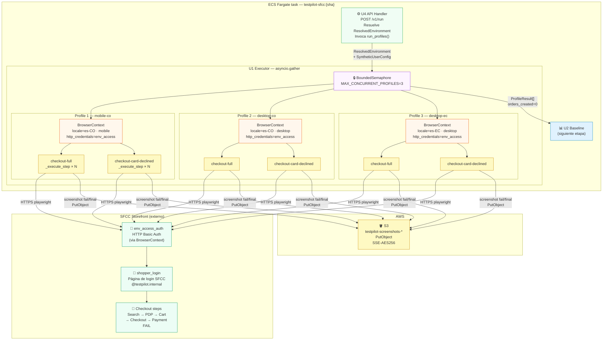
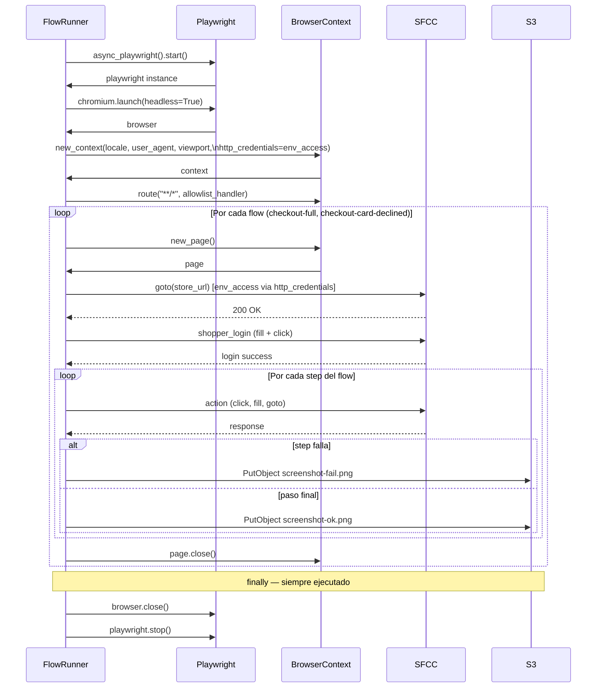

# Deployment Architecture — U1 Executor Playwright (2026-05-28)

> Para la arquitectura completa del sistema ver: `aidlc-docs/construction/u4/infrastructure-design/deployment-architecture.md`
> Este diagrama focaliza en el scope de U1: ejecución paralela de flows + screenshots.

---

## Diagrama — U1 dentro del ECS task

---

## Diagrama — Ciclo de vida de un BrowserContext

---

## Invariantes verificados en U1

| Invariante | Dónde se verifica | Acción si falla |
|---|---|---|
| `orders_created == 0` | `run_profile` — assert antes de retornar | `AssertionError` → capturado por U4, HTTP 500 + CloudWatch alarm |
| `shopper.email.endswith("@testpilot.internal")` | `run_profile` — assert al inicio | `AssertionError` → run abortado |
| `screenshot_on_error is True` | `run_profile` — assert al inicio | `AssertionError` — configuración inválida |
| Sin `time.sleep` en flows | ruff rule + grep en CI | `ruff check` falla el PR |
| `InfrastructureError` en env_access | `_step_env_access` | `ProfileResult(traffic_light=YELLOW)` — no RED |
