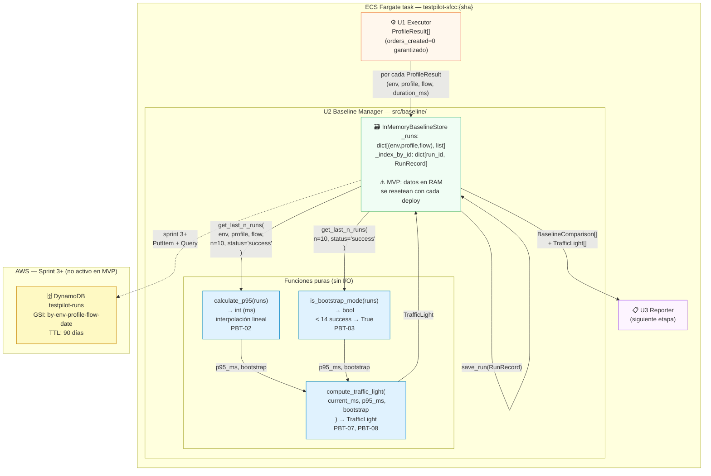
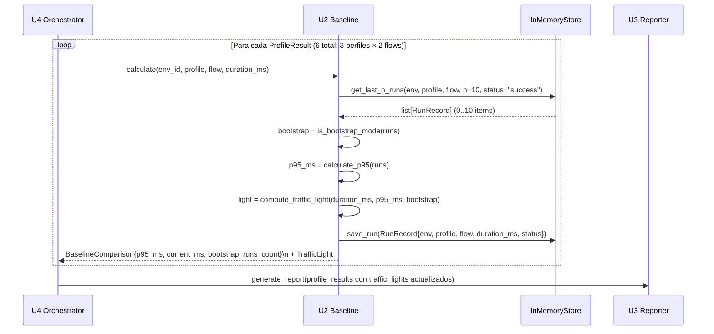
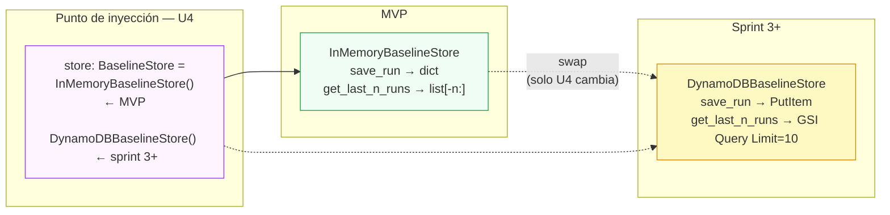

# Deployment Architecture — U2 Baseline Manager (2026-05-28)

> Para la arquitectura completa del sistema ver: `aidlc-docs/construction/u4/infrastructure-design/deployment-architecture.md`
> Este diagrama focaliza en el scope de U2: cálculo de baseline y decisión de semáforo.

---

## Diagrama — U2 dentro del ECS task (MVP)

---

## Diagrama — Flujo de cálculo por perfil

---

## Transición MVP → Sprint 3+ (DynamoDB)

U3 y el resto del sistema no cambian — el Protocol garantiza que el swap es transparente.

---

## Invariantes de U2 verificados en runtime

| Invariante | Verificación | Consecuencia si falla |
|---|---|---|
| `bootstrap=True` nunca produce `YELLOW` | PBT-07 en test suite | Alerta falsa → daña confianza del equipo |
| `current > p95 * 1.5` siempre produce `RED` | PBT-08 en test suite | Regresión no detectada → deploy con bug |
| `calculate_p95([])` retorna `0` | Test unitario | `compute_traffic_light` con `p95=0` → GREEN (safe default) |
| Baseline aislado por `environment_id` | Test de aislamiento | Sandbox contamina staging → falsos positivos |
