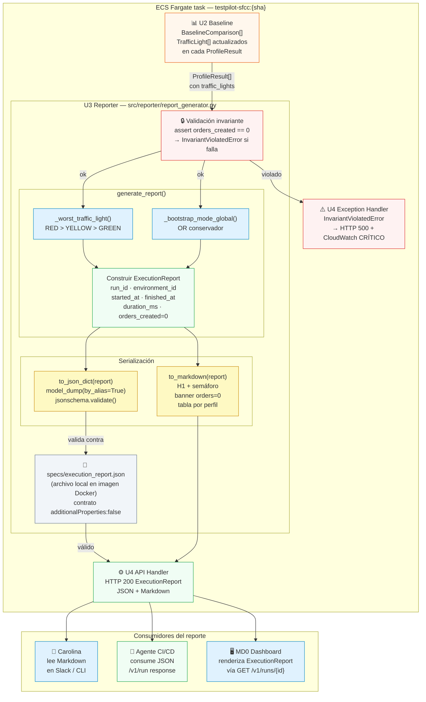
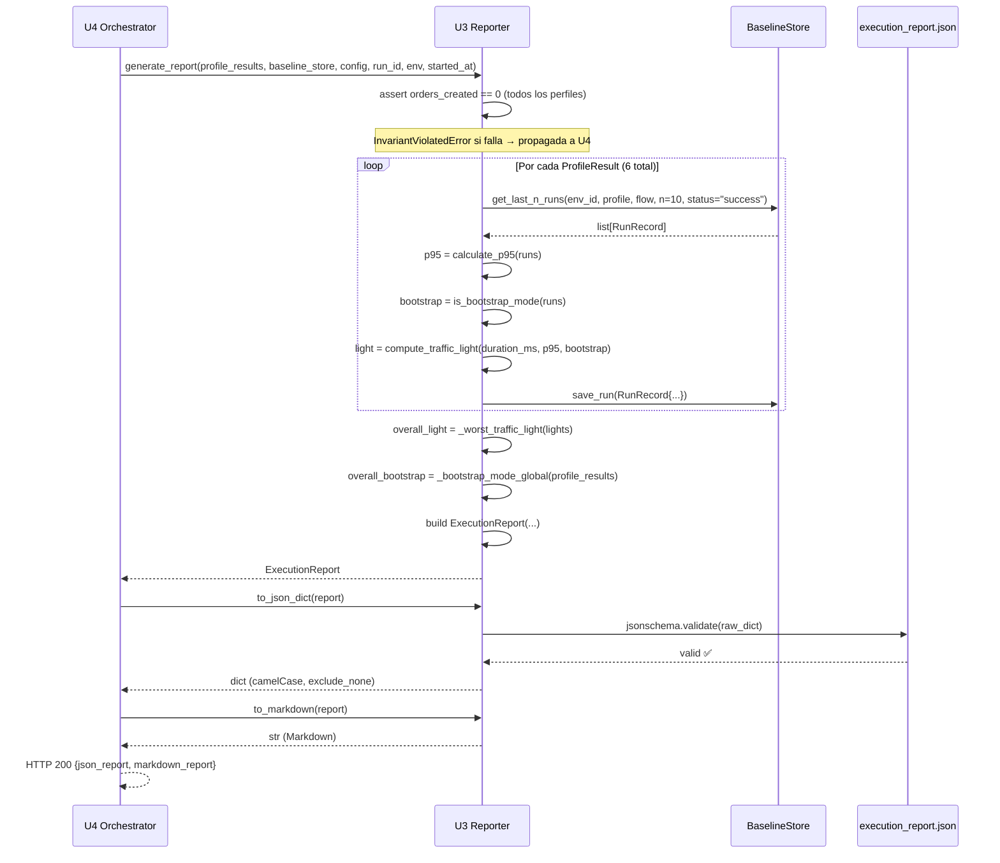

# Deployment Architecture — U3 Reporter (2026-05-28)

> Para la arquitectura completa del sistema ver: `aidlc-docs/construction/u4/infrastructure-design/deployment-architecture.md`
> Este diagrama focaliza en el scope de U3: generación del reporte y serialización del contrato.

---

## Diagrama — U3 dentro del ECS task

---

## Diagrama — Flujo interno de `generate_report`

---

## Garantías de contrato que U3 provee a sus consumidores

| Consumidor | Garantía | Mecanismo |
|---|---|---|
| Agente CI/CD (JSON) | Siempre conforme a `specs/execution_report.json` | `jsonschema.validate` en cada call — falla rápido si no |
| Carolina (Markdown) | Primera línea siempre `# {emoji} TestPilot Run…` | BR-U3-07 + PBT-U3-01 |
| MD0 Dashboard (JSON) | `orders_created` siempre visible y siempre `0` | BR-U3-01 + NFR-U3-S2 |
| Cualquier consumidor | Sin credenciales ni PII en el output | NFR-U3-S1 + test regex |
| U4 (excepciones) | `InvariantViolatedError` nunca silenciada en U3 | NFR-U3-R2 — solo U4 la captura |
