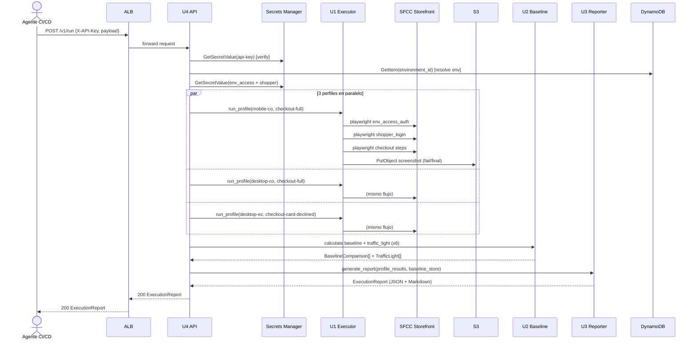
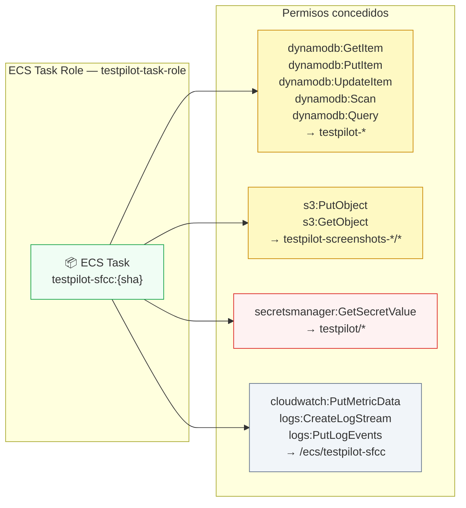

# Deployment Architecture — U4 API Endpoints (2026-05-28)

Este es el diagrama de despliegue **canónico del sistema completo** TestPilot SFCC. U1, U2, U3 y MD0 operan dentro del mismo ECS task — sus diagramas de despliegue referencian este documento.

---

## Diagrama — Arquitectura completa (producción)

```mermaid
graph TB
    subgraph "Actores"
        CAROLINA["👤 Carolina\nQA Engineer\n(VPN)"]
        ANDRES["👤 Andrés\nTech Lead\n(VPN)"]
        CICD["🤖 Agente CI/CD\n(GitHub Actions / Jenkins)"]
    end

    subgraph "AWS — Región configurada"

        subgraph "Networking"
            ALB["⚖️ ALB internal\nHTTPS :443\nTLS 1.2+ · ACM cert\nWAF managed rules"]
        end

        subgraph "ECS Fargate — testpilot-sfcc:{sha}"
            subgraph "FastAPI :8000"
                MW["🛡️ Middleware\nSecurityHeaders\nRedactingJsonLogger\nAPIKeyAuth"]
                ROUTER4["🔀 Router U4\nPOST /v1/run\nGET /v1/runs/{id}\nGET /v1/runs/latest\nGET /v1/runs/{id}/status\nGET /v1/environments\nGET /health"]
                U1["⚙️ U1 Executor\nsrc/executor/\nPlaywright async\n3 perfiles × 2 flows"]
                U2["📊 U2 Baseline\nsrc/baseline/\nInMemoryStore (MVP)\ncalculate_p95"]
                U3["📋 U3 Reporter\nsrc/reporter/\nJSON + Markdown\ntraffic_light"]
                MD0_STATIC["🖥️ MD0 Dashboard\nStaticFiles /\nsrc/dashboard/dist/"]
            end
        end

        subgraph "Almacenamiento"
            DDB_ENV["🗄️ DynamoDB\ntestpilot-environments\nPK: environment_id"]
            DDB_RUNS["🗄️ DynamoDB\ntestpilot-runs\n(sprint 3+)\nTTL: 90 días"]
            S3["🪣 S3\ntestpilot-screenshots-*\nLifecycle: STD→IA→Glacier→delete (90d)"]
        end

        subgraph "Secrets & Config"
            SM["🔑 Secrets Manager\ntestpilot/*/env-access\ntestpilot/*/shopper\ntestpilot/api/api-key\ntestpilot/api/anthropic-key"]
            ECR["🗂️ ECR\ntestpilot-sfcc:{sha}"]
        end

        subgraph "Observabilidad"
            CW_LOGS["📋 CloudWatch Logs\n/ecs/testpilot-sfcc\nRetención 14 días"]
            CW_METRICS["📈 CloudWatch Metrics\ntestpilot.run.*\ntestpilot.api.*\ntestpilot.invariant_violated"]
            CW_ALARMS["🚨 CloudWatch Alarms\ninvariant_violated > 0 → CRÍTICO\nerror_rate > 10% → WARNING\ntask unhealthy → AUTO-REPLACE"]
        end

        subgraph "Externos"
            ANTHROPIC["🧠 Anthropic API\nclaude-haiku-4-5\n(NL → SyntheticUserConfig)"]
            SFCC["🛍️ SFCC Storefront\nhttps://{env}.tienda.com\nHTTP Basic Auth\n+ Shopper login"]
        end
    end

    %% Flujo de usuarios
    CAROLINA -->|"HTTPS dashboard"| ALB
    ANDRES -->|"HTTPS dashboard"| ALB
    CICD -->|"POST /v1/run\nX-API-Key"| ALB

    %% ALB → FastAPI
    ALB --> MW
    MW --> ROUTER4
    ROUTER4 -->|"GET /"| MD0_STATIC
    ROUTER4 -->|"POST /v1/run"| U1
    ROUTER4 -->|"resolve environment"| DDB_ENV

    %% Pipeline de ejecución
    U1 -->|"NL → config\nAnthropicSDK"| ANTHROPIC
    U1 -->|"playwright chromium\nenv_access + shopper"| SFCC
    U1 -->|"screenshots\nPutObject"| S3
    U1 -->|"ProfileResult[]"| U2
    U2 -->|"BaselineComparison\nTrafficLight"| U3
    U3 -->|"ExecutionReport\nJSON + Markdown"| ROUTER4

    %% Persistencia
    U2 -.->|"sprint 3+\nsave_run"| DDB_RUNS
    ROUTER4 -->|"store report\nGetItem"| DDB_RUNS

    %% Secrets
    U1 -->|"GetSecretValue\nenv_access + shopper"| SM
    MW -->|"GetSecretValue\napi-key + anthropic-key"| SM

    %% Observabilidad
    MW --> CW_LOGS
    ROUTER4 --> CW_METRICS
    CW_METRICS --> CW_ALARMS

    %% Image supply chain
    ECR -->|"pull image"| ECS Fargate

    style CAROLINA fill:#e0f2fe,stroke:#0284c7
    style ANDRES fill:#e0f2fe,stroke:#0284c7
    style CICD fill:#f0fdf4,stroke:#16a34a
    style ALB fill:#fef3c7,stroke:#d97706
    style MW fill:#fdf4ff,stroke:#9333ea
    style ROUTER4 fill:#f0fdf4,stroke:#16a34a
    style U1 fill:#fff7ed,stroke:#ea580c
    style U2 fill:#fff7ed,stroke:#ea580c
    style U3 fill:#fff7ed,stroke:#ea580c
    style MD0_STATIC fill:#e0f2fe,stroke:#0284c7
    style DDB_ENV fill:#fef9c3,stroke:#ca8a04
    style DDB_RUNS fill:#fef9c3,stroke:#ca8a04
    style S3 fill:#fef9c3,stroke:#ca8a04
    style SM fill:#fef2f2,stroke:#dc2626
    style ECR fill:#f1f5f9,stroke:#64748b
    style CW_LOGS fill:#f1f5f9,stroke:#64748b
    style CW_METRICS fill:#f1f5f9,stroke:#64748b
    style CW_ALARMS fill:#fef2f2,stroke:#dc2626
    style ANTHROPIC fill:#fdf4ff,stroke:#9333ea
    style SFCC fill:#ecfdf5,stroke:#059669
```

---

## Diagrama — Flujo de un run completo (secuencia)



---

## Diagrama — IAM Role (mínimo privilegio)



---

## Referencia de variables de entorno del ECS task

| Variable | Fuente | Unidad propietaria |
|---|---|---|
| `TESTPILOT_API_KEY` | Secrets Manager → `testpilot/api/api-key` | U4 |
| `ANTHROPIC_API_KEY` | Secrets Manager → `testpilot/api/anthropic-key` | U1 (agents) |
| `AWS_REGION` | ECS runtime | U4 |
| `DYNAMODB_TABLE_ENVIRONMENTS` | Task definition env var | U4 |
| `DYNAMODB_TABLE_RUNS` | Task definition env var | U4 (sprint 3+) |
| `S3_BUCKET_SCREENSHOTS` | Task definition env var | U1 |
| `SECRETS_MANAGER_PREFIX` | Task definition env var | U4 |
| `MAX_CONCURRENT_PROFILES` | Task definition env var | U1 |
| `RUN_TIMEOUT_SECONDS` | Task definition env var | U4 |
| `LOG_LEVEL` | Task definition env var | U0 (logging config) |
| `DOCS_ENABLED` | Task definition env var | U4 |
| `GIT_SHA` | Injected by CI | U0 (imagen tag) |

---

## Estimación de costos AWS/mes (MVP)

| Servicio | Configuración | Costo estimado |
|---|---|---|
| ECS Fargate | 1 task · 1 vCPU · 2 GB · on-demand | ~$80 |
| ALB (internal) | 1 ALB · baja concurrencia | ~$22 |
| DynamoDB | 2 tablas on-demand · ~$6 escrituras/día | ~$6 |
| S3 | 10 runs/día · lifecycle STD→IA→Glacier | ~$15–20 |
| Secrets Manager | 8 secrets | ~$3 |
| CloudWatch | Logs 14d + métricas custom | ~$5 |
| ECR | 1 imagen ~1.5 GB · 30d retention | ~$2 |
| Data transfer | Estimado interno | ~$3 |
| **TOTAL MVP** | | **~$136–141/mes** |

Trigger de revisión: si supera $200/mes en sprint 2 → bajar `screenshot_on_success` a `false` por defecto (ahorra ~$15/mes).
