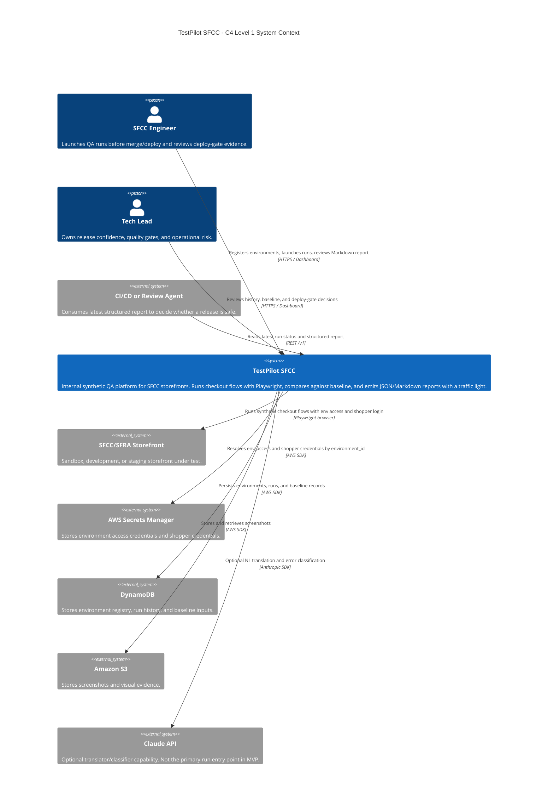
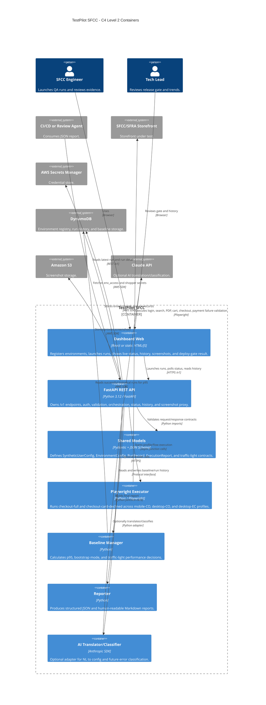

# C4 Diagrams - TestPilot SFCC

> Station 4 critical artifact. These diagrams describe the intended MVP architecture for TestPilot SFCC from an ecommerce/SFCC product ownership perspective: release safety, checkout stability, environment isolation, and consumption by both engineers and downstream agents.

## Level 1 - System Context

### Level 1 Notes

- `TestPilot SFCC` is an internal release-confidence system, not a public SaaS.
- The primary business user is the SFCC engineering team that needs a deploy-safe decision in less than 30 minutes.
- The system boundary intentionally excludes SFCC production execution for MVP; the target environments are sandbox, development, and staging.
- Credentials never enter the run payload. `environment_id` is the only selector used to resolve URLs and secrets.

## Level 2 - Container

### Level 2 Notes

- The API is the integration hub. Dashboard and downstream agents should consume `/v1/*`; they should not read storage directly.
- `Shared Models` protect downstream agents from schema drift. Any field change in `specs/` remains a contract concern.
- `Baseline Manager` is intentionally isolated from the executor so Playwright code never writes directly to DynamoDB.
- `Playwright Executor` only handles browser behavior and step results. It does not own reporting, baseline, or persistence decisions.
- `AI Translator/Classifier` is optional for MVP execution; structured `SyntheticUserConfig` remains the safest primary entry point.

## Validation Notes

| Concern | Architectural Answer |
|---|---|
| Release decision must be fast | Three critical profiles run in parallel behind the API/orchestrator. |
| Checkout must not create orders | Payment failure is an invariant of executor flows and is asserted by reporter/API layers. |
| Credentials must not leak | Payload carries `environment_id`; API resolves secrets from Secrets Manager and redacts logs. |
| Reports must be agent-readable | `ExecutionReport` is a typed contract emitted as JSON under `/v1`. |
| SFCC selector fragility | Selectors are centralized in `src/executor/selectors.py`; future auto-healing remains outside MVP. |
| Baseline must avoid false yellows | Bootstrap mode blocks yellow performance alerts until 14 successful runs exist. |
