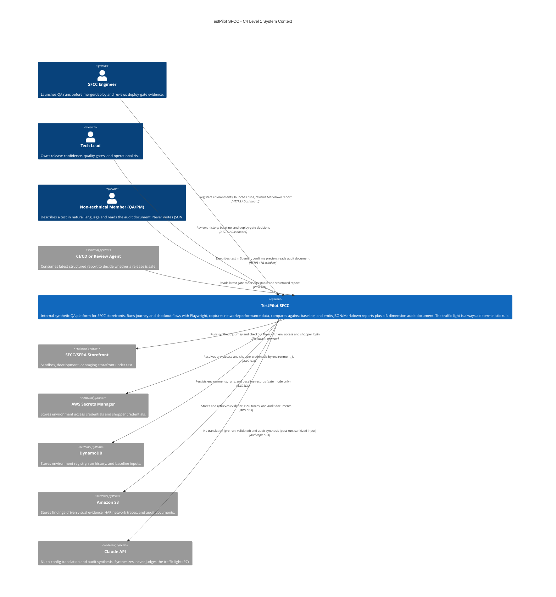
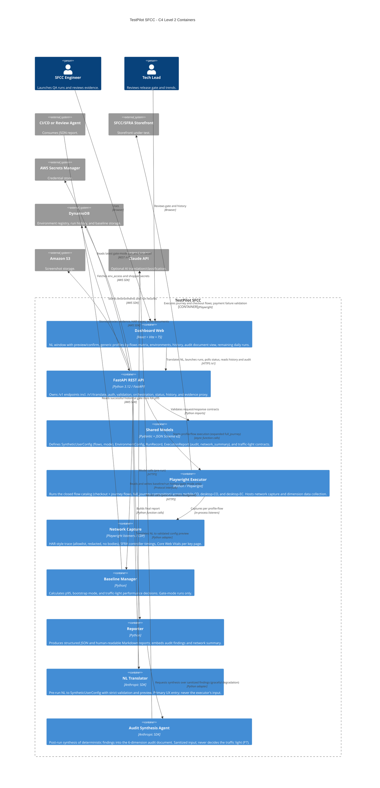

# C4 Diagrams - TestPilot SFCC

> Station 4 critical artifact. These diagrams describe the intended architecture for TestPilot SFCC from an ecommerce/SFCC product ownership perspective: release safety, checkout stability, environment isolation, and consumption by both engineers and downstream agents.
>
> **Realigned 2026-06-03** (branch `rework/storefront-audit-scope`): adds the non-technical user
> (NL window), journey flows, the audit synthesis agent (P7 — never decides the traffic light),
> and network/performance capture. Wave 1 (checkout gate) semantics unchanged.

## Level 1 - System Context

### Level 1 Notes

- `TestPilot SFCC` is an internal release-confidence system, not a public SaaS.
- The primary business user is the SFCC engineering team that needs a deploy-safe decision in less than 30 minutes; the realignment adds non-technical members (QA/PM/business) via the NL window (UC6).
- The system boundary intentionally excludes SFCC production execution; the target environments are sandbox, development, and staging.
- Credentials never enter the run payload. `environment_id` is the only selector used to resolve URLs and secrets.
- Claude API has exactly two roles, both bounded: (a) pre-run NL→config translation, always schema+catalog validated with user-confirmed preview (the NL text never reaches the executor — C12); (b) post-run audit synthesis over deterministic findings with sanitized input (the agent never decides the traffic light — P7/C10).
- Two operation modes: `gate` (deterministic, feeds the baseline, blocks deploys) and `exploratory` (discovery; never enters the baseline — C11).

## Level 2 - Container

### Level 2 Notes

- The API is the integration hub. Dashboard and downstream agents should consume `/v1/*`; they should not read storage directly.
- `Shared Models` protect downstream agents from schema drift. Any field change in `specs/` remains a contract concern (now at v2 — HITL approved 2026-06-03).
- `Baseline Manager` is intentionally isolated from the executor so Playwright code never writes directly to DynamoDB. Only gate-mode runs feed it (C11).
- `Playwright Executor` only handles browser behavior, step results, and raw data capture (prices, URLs, network, console). It does not own reporting, baseline, audit synthesis, or persistence decisions.
- `NL Translator` and `Audit Synthesis Agent` are the only two Claude API touchpoints, on opposite sides of the run: translator pre-run (validated, previewed, confirmed), audit agent post-run (sanitized findings in, prose out). Neither can alter the traffic light or reach the storefront.
- `full_journey` is expanded by the API/FlowCatalog before execution — the executor only ever sees modular flows.

## Validation Notes

| Concern | Architectural Answer |
|---|---|
| Release decision must be fast | Three critical profiles run in parallel behind the API/orchestrator. |
| Checkout must not create orders | Payment failure is an invariant of executor flows and is asserted by reporter/API layers. Journey flows contain no payment steps at all. |
| Credentials must not leak | Payload carries `environment_id`; API resolves secrets from Secrets Manager and redacts logs. HAR traces persist metadata+timings only, with auth headers/cookies redacted. |
| Reports must be agent-readable | `ExecutionReport` is a typed contract emitted as JSON under `/v1` (v2). |
| SFCC selector fragility | Selectors are centralized in `src/executor/selectors.py`; future auto-healing remains outside MVP. |
| Baseline must avoid false yellows | Bootstrap mode blocks yellow performance alerts until 14 successful runs exist — per profile-flow pair, so each new catalog flow bootstraps independently. |
| LLM must not produce false verdicts | P7/C10: the audit agent synthesizes over deterministic findings and cannot move the traffic light; the NL translator output is schema+catalog validated with user-confirmed preview before any browser launches. |
| Exploration must not pollute the gate | `mode=exploratory` runs never enter the baseline and are excluded from `/v1/runs/latest` gate decisions. |
| Audit evidence must not explode cost | ADR-003: findings-driven captures only (finding or declared critical point); C4 cost KPI watched; S3 lifecycle 90d → Glacier. |
