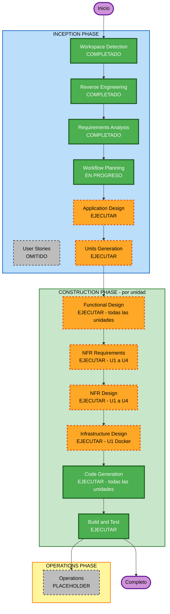

# Execution Plan — TestPilot SFCC

## Detailed Analysis Summary

### Transformation Scope (Brownfield)
- **Transformation Type**: Architectural expansion — construcción de 4 módulos nuevos + refactor de modelos + setup de proyecto
- **Primary Changes**: executor (Playwright), baseline (DynamoDB stub), reporter (JSON+MD+semáforo), API endpoints GET + integración POST
- **Related Components**: src/models.py (nuevo), src/agents/translator.py (update), src/api/main.py (expansión)

### Change Impact Assessment
| Área | ¿Impacta? | Descripción |
|------|-----------|-------------|
| User-facing changes | Sí | Nuevos endpoints GET /v1/runs/{id} y GET /v1/runs/latest |
| Structural changes | Sí | 4 módulos nuevos, src/models.py unificado |
| Data model changes | Sí | BrowserProfile, FlowResult, ProfileResult, TrafficLight, RunRecord |
| API changes | Sí | POST /v1/run pasa de stub a ejecución real; 2 nuevos endpoints GET |
| NFR impact | Sí | Security (auth, logging, input validation), PBT (hypothesis), Docker |

### Component Relationships
```
U0 Setup base
  src/models.py           (nuevo — unifica SyntheticUserConfig)
  pyproject.toml          (nuevo — dependencias pinned)
  src/agents/translator.py (actualizar modelo Claude)
       |
       v (todos dependen de U0)
       +---> U1 Executor (src/executor/)
       |     profiles/ flows/ selectors.py runner.py
       |
       +---> U2 Baseline Manager (src/baseline/)
       |     baseline_manager.py (InMemoryBaselineStore + p95 + semaforo)
       |
       +---> U3 Reporter (src/reporter/)
             report_generator.py (depende de U2 para TrafficLight)
                  |
                  v
             U4 API Endpoints (src/api/main.py)
             GET /v1/runs/{id}, GET /v1/runs/latest
             POST /v1/run integrado con executor+reporter
```

### Risk Assessment
| Factor | Nivel | Detalle |
|--------|-------|---------|
| **Risk Level** | High | Sistema nuevo complejo: LLM + Playwright + datos estadísticos |
| **Rollback Complexity** | Moderate | Módulos independientes; se puede revertir por módulo |
| **Testing Complexity** | Complex | Playwright requiere browser real; Claude API requiere mocks |
| **Mitigación principal** | Stubs locales | InMemoryBaselineStore + selectores parametrizados desacoplan del ambiente real |

---

## Workflow Visualization



### Representación de texto (alternativa)

```
INCEPTION PHASE:
  [OK] Workspace Detection   — COMPLETADO
  [OK] Reverse Engineering   — COMPLETADO
  [OK] Requirements Analysis — COMPLETADO
  [--] User Stories          — OMITIDO (PRD cubre personas y journeys)
  [OK] Workflow Planning     — EN PROGRESO
  [>>] Application Design    — EJECUTAR (4 módulos nuevos + refactor)
  [>>] Units Generation      — EJECUTAR (6 unidades U0-U4 + MD0)

CONSTRUCTION PHASE (por unidad U0 → U4):
  [>>] Functional Design     — EJECUTAR (modelos de datos + lógica negocio)
  [>>] NFR Requirements      — EJECUTAR (U1-U4: security, PBT, Docker)
  [>>] NFR Design            — EJECUTAR (sigue NFR Requirements)
  [>>] Infrastructure Design — EJECUTAR (U1 únicamente: Dockerfile Playwright)
  [>>] Code Generation       — EJECUTAR (siempre, por unidad)
  [>>] Build and Test        — EJECUTAR (siempre, al final)

OPERATIONS PHASE:
  [--] Operations            — PLACEHOLDER (futuro)
```

---

## Phases to Execute

### INCEPTION PHASE
- [x] Workspace Detection — COMPLETADO
- [x] Reverse Engineering — COMPLETADO
- [x] Requirements Analysis — COMPLETADO
- [x] User Stories — **COMPLETADO 2026-05-22 (reactivada)**
  - **Rationale original (2026-05-20)**: El PRD v1.0 documenta exhaustivamente las personas (U1, U2, A1-A4), user journeys (J1-J4) y criterios de aceptación. Agregar User Stories sería redundante.
  - **Reactivación (2026-05-22)**: Auditoría posterior detectó gaps de diseño (B1–B5 bloqueantes, A1–A7 alto riesgo) que requerían decisiones consolidadas. Se generaron 21 historias con 83 ACs en `inception/user-stories/user-stories.md`, cerrando 8 gaps y trazando 13 Design Decisions (D1–D13). Cobertura MoSCoW final en `coverage-matrix.md`: 14/18 completo, 1 simplificado documentado (M10), 2 simplificados (M13, M14), 1 aplazado (M15), 1 operativo (M18).
- [x] Workflow Planning — EN PROGRESO
- [ ] Application Design — **EJECUTAR**
  - **Rationale**: 4 módulos completamente nuevos (executor, baseline, reporter) + 1 refactor de modelos. Las interfaces entre módulos, firmas de métodos y dependencias necesitan diseño explícito antes de generar código.
- [ ] Units Generation — **EJECUTAR**
  - **Rationale**: 6 unidades de trabajo con dependencias secuenciales (U0→U1,U2,U3,MD0→U4). MD0 puede desarrollarse en paralelo con mocks de API. El mapa formal de unidades es necesario para guiar el Construction Phase.

### CONSTRUCTION PHASE
- [ ] Functional Design — **EJECUTAR (todas las unidades)**
  - **Rationale**: Modelos de datos nuevos (BrowserProfile, FlowResult, RunRecord, TrafficLight), lógica estadística (p95), e invariantes de negocio (orders_created=0, bootstrap) requieren diseño detallado por unidad.
- [ ] NFR Requirements — **EJECUTAR (todas las unidades U0-U4 + MD0)**
  - **Rationale actualizado 2026-05-24**: U0 ahora tiene NFR (supply chain pinning, image hardening); U1-U4 tienen requisitos de seguridad (SECURITY extension), PBT (hypothesis) y performance; MD0 tiene NFR de frontend (CSP, accesibilidad, polling).
- [ ] NFR Design — **EJECUTAR (U1, U4, MD0)**
  - **Rationale**: Patrones de logging estructurado, manejo de errores seguro (SECURITY-15), generadores Hypothesis (PBT-07), patrones de frontend (usePolling, CSP middleware) necesitan diseño explícito.
- [ ] Infrastructure Design — **EJECUTAR (U0, U4, MD0)**
  - **Rationale actualizado 2026-05-24**: U0 requiere Dockerfile multi-stage (Node builder + Python runtime con Playwright); U4 requiere DynamoDB + S3 + Secrets Manager + ALB; MD0 requiere build pipeline Vite + integración con FastAPI StaticFiles + CSP headers.
- [ ] Code Generation — **EJECUTAR (siempre, por unidad)**
- [ ] Build and Test — **EJECUTAR (siempre)**

### OPERATIONS PHASE
- [ ] Operations — **PLACEHOLDER** (no se ejecuta en esta sesión)

---

## Package Change Sequence

| Orden | Unidad | Módulos | Puede paralelizarse con |
|-------|--------|---------|------------------------|
| 1 | **U0 Setup base** | pyproject.toml, src/models.py, Dockerfile multi-stage, translator update | Nada (prerrequisito) |
| 2 | **U1 Executor** | src/executor/ (profiles, selectors, auth/, flows, runner) | U2, MD0 |
| 2 | **U2 Baseline Manager** | src/baseline/baseline_manager.py | U1, MD0 |
| 2 | **MD0 Dashboard** | src/dashboard/ (React+Vite+TS+Tailwind, 5 pantallas) | U1, U2 (usando mocks de API hasta que U4 esté listo) |
| 3 | **U3 Reporter** | src/reporter/report_generator.py | Depende de U2 |
| 4 | **U4 API Endpoints** | src/api/ (routers, services, middleware) — 13 endpoints | Depende de U1+U2+U3 |
| 5 | **Integración MD0 ↔ U4** | Apuntar dashboard a backend real | — |

---

## Estimated Timeline

| Fase | Etapas | Estimación |
|------|--------|------------|
| Inception restante | Application Design + Units Generation | ~30-45 min |
| Construction U0 | Setup | ~20-30 min |
| Construction U1 | Executor (Playwright) | ~60-90 min |
| Construction U2 | Baseline Manager | ~30-45 min |
| Construction U3 | Reporter | ~30-45 min |
| Construction U4 | API Endpoints | ~30-40 min |
| Build and Test | Instrucciones + verificación | ~20-30 min |
| **Total estimado** | | **4-6 horas** |

---

## Success Criteria

- **Primary Goal**: TestPilot SFCC ejecuta los 2 flows Playwright sobre los 3 perfiles, genera reporte con semáforo, y expone el resultado vía API REST
- **Key Deliverables**:
  - `src/models.py` — modelos compartidos
  - `src/executor/` — profiles, selectors, flows, runner
  - `src/baseline/baseline_manager.py` — p95, bootstrap, semáforo
  - `src/reporter/report_generator.py` — JSON+MD+semáforo
  - `src/api/main.py` (expandido) — GET endpoints + POST real
  - `pyproject.toml` — dependencias pinned
  - `Dockerfile` — imagen Playwright
  - `tests/` — unit tests + PBT (hypothesis) para baseline y reporter
- **Quality Gates**:
  - `ruff check .` sin errores
  - `mypy src/` sin errores de tipo
  - `pytest` con todos los tests pasando
  - Security: SECURITY-03, SECURITY-05, SECURITY-08, SECURITY-10, SECURITY-12 satisfechos
  - PBT: hypothesis tests para `calculate_p95()`, `compute_traffic_light()`, round-trip ExecutionReport
  - `orders_created=0` assertion en todos los flows
  - Ninguna credencial en código ni en logs
