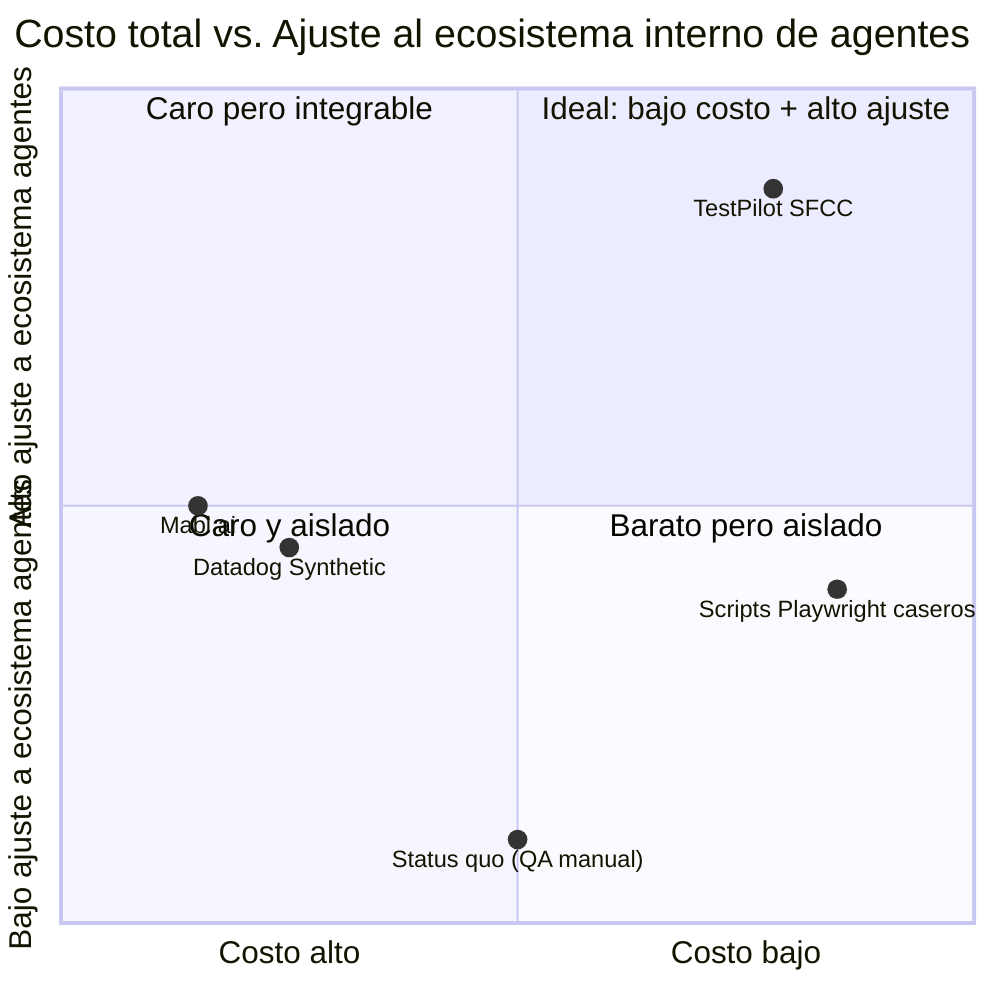
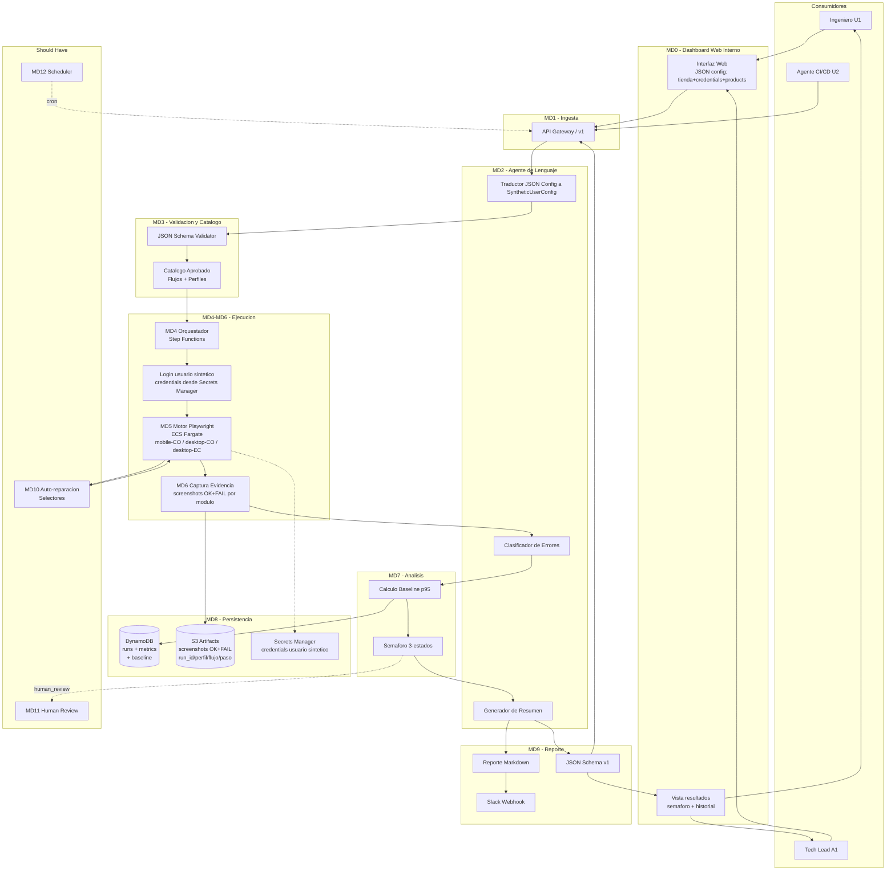
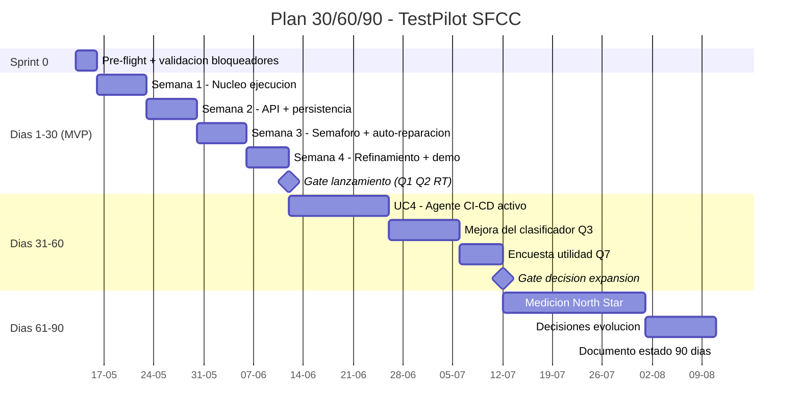

# PRD — TestPilot SFCC

> Plataforma de Testing Continuo con Usuarios Sintéticos para Salesforce Commerce Cloud
> Producto interno de la empresa — no comercializable

| Campo         | Valor                                                  |
| ------------- | ------------------------------------------------------ |
| Versión       | 1.1                                                    |
| Fecha         | 2026-05-22 (rev. dashboard + login + screenshots + Ecuador) |
| Autor         | Christian Díaz                                         |
| Sponsor       | Tech Lead / Gerente de Tecnología                      |
| Co-creado con | Claude (Anthropic) — Hardcore AI Cohorte 2, Estación 2 |
| Horizonte     | MVP en 4 semanas + plan 90 días post-lanzamiento       |

---

## Tabla de Contenidos

- [Resumen Ejecutivo](#resumen-ejecutivo)
- [Paso 0 — Análisis de Conflictos y Decisiones Estructurales](#paso-0--análisis-de-conflictos-y-decisiones-estructurales)
- [1. One-Liner, JTBD y Misión](#1-one-liner-jtbd-y-misión)
- [2. Contexto y Problema](#2-contexto-y-problema)
- [3. Perfil del Equipo Usuario y Stakeholders de Adopción Interna](#3-perfil-del-equipo-usuario-y-stakeholders-de-adopción-interna)
- [4. Valor Único vs. Alternativas + Matriz de Decisión](#4-valor-único-vs-alternativas--matriz-de-decisión)
- [5. Casos de Uso Top 5](#5-casos-de-uso-top-5)
- [6. Principios de Diseño No Negociables](#6-principios-de-diseño-no-negociables)
- [7. User Journeys](#7-user-journeys)
- [8. MVP Scope — MoSCoW](#8-mvp-scope--moscow)
- [9. Especificación Funcional: Módulos y Features](#9-especificación-funcional-módulos-y-features)
- [10. Métricas de Éxito](#10-métricas-de-éxito)
- [11. Plan de Evaluación del Agente](#11-plan-de-evaluación-del-agente)
- [12. Riesgos y Mitigaciones](#12-riesgos-y-mitigaciones)
- [13. Plan de Entrega 30/60/90 Días](#13-plan-de-entrega-306090-días)
- [Apéndices](#apéndices)

---

## Resumen Ejecutivo

**¿Qué es?** TestPilot SFCC es un sistema compuesto por un **dashboard web interno** para configurar y visualizar pruebas, y un **agente de testing** que genera usuarios sintéticos parametrizados, ejecuta flujos críticos sobre una tienda SFCC en staging vía Playwright, y devuelve un reporte estructurado (JSON + markdown + semáforo) consumible por humanos y otros agentes del ecosistema interno de la empresa.

**¿Qué problema resuelve?** Hoy el equipo gasta 4-8 horas de ingeniería por release validando manualmente la tienda. No existe baseline de performance ni historial. Las regresiones se detectan días o semanas tarde, cuando el negocio nota una caída en conversión.

**¿Cuál es la propuesta?** En 4 semanas, entregar una v1 con dashboard web interno + agente que ejecute 2 flujos (`checkout-full` + `checkout-card-declined`) sobre 3 perfiles (`mobile/CO`, `desktop/CO`, `desktop/EC`), con login como primer paso de cada flujo, y endpoint REST versionado consumible por agentes downstream del equipo (CI/CD bot, code-review agent).

**¿Cuál es el valor diferencial?** Frente a Datadog ($200-$2,000/mes) y Mabl (>$2,500/mes), TestPilot ofrece: (a) costo de infra <$50/mes; (b) JSON versionado pensado desde día 1 para consumo programático por agentes internos; (c) auto-reparación mínima de selectores vía LLM que reduce mantenimiento crítico en SFCC.

**¿Cuál es el North Star?** Reducir el tiempo desde "PR listo para mergear" hasta "decisión deploy-safe documentada" de **4-8 horas a <30 minutos** en semana 4, y a **<10 minutos** en semana 12 (cuando el agente CI/CD aprueba auto-merge con semáforo verde reciente).

**¿Qué riesgos críticos vigilar?** (1) Anti-bot de SFCC bloqueando Playwright en staging — validado en sprint 0; (2) Falsos verdes que permitan bugs en producción (meta Q5 ≤ 5%); (3) Adopción del equipo post-curso (mitigado con auto-reparación de selectores + onboarding de 2do dev en semana 4).

---

## Paso 0 — Análisis de Conflictos y Decisiones Estructurales

Antes de redactar el PRD se realizó un cruce exhaustivo de los 3 documentos en `docs/` (`hcai-c2-internal-solution-brief.md`, `deep-research-validacion.md`, `deep-research-critica.md`). Se identificaron 7 conflictos y 5 vacíos. Estas son las decisiones estructurales que moldean el resto del PRD.

### Conflictos resueltos

| #      | Conflicto                                                                                   | Decisión final                                                                       |
| ------ | ------------------------------------------------------------------------------------------- | ------------------------------------------------------------------------------------ |
| **C1** | Tiempo de QA manual: 4-8 h (Brief) vs. 40 h (Validación)                                    | Usar 4-8 h como cifra del equipo; 40 h queda como benchmark de industria             |
| **C2** | Auto-reparación de selectores: fuera del MVP (Brief) vs. diferenciador crítico (Validación) | Moverla a **Should Have** (S1) — versión mínima en v1                                |
| **C3** | Anti-bot mitigable con excepción de IP (Brief) vs. requiere evasión compleja (Crítica)      | **Validar en sprint 0** si staging tiene anti-bot; escalar si lo tiene               |
| **C4** | Umbral de alerta de performance: 20% (Brief) vs. varianza natural ±40% (Crítica)            | Usar **p95 de últimas 10 ejecuciones**, no umbral fijo                               |
| **C5** | Cadencia: pre-deploy (Brief) vs. monitor continuo (Validación)                              | v1 es **gate pre-deploy**; monitor continuo entra en Could Have                      |
| **C6** | Cómo evitar órdenes contaminantes en staging                                                | **Payment method de prueba que falla en paso final** + cliente `@testpilot.internal` |
| **C7** | Costo de screenshots a escala                                                               | Screenshots en **todos los módulos, estado OK y FAIL** — `{run_id}/{perfil}/{flujo}/{paso}-{ok\|fail}.png`. Decisión revisada: captura completa para aumentar confianza del equipo en reportes visuales. Costo ~17 GB/mes. Revisar en semana 2. |

### Vacíos críticos reconocidos (sin material primario para citar)

| #      | Vacío                                                | Cómo se aborda                                                                   |
| ------ | ---------------------------------------------------- | -------------------------------------------------------------------------------- |
| **V1** | Sin baseline real de métricas actuales de la tienda  | Marcado TBD; medirlo es parte del plan 30/60/90                                  |
| **V2** | Sin transcripciones de usuarios/equipo               | Objeciones del Segmento 3 son inferidas, no verbatim                             |
| **V3** | Sin groundtruth de "error real vs. esperado"         | Se construye operativamente durante bootstrapping + human-review (Segmento 11.5) |
| **V4** | Sin inventario de cartridges custom y sus selectores | Listado como prerequisito del sprint 0                                           |
| **V5** | Sin acuerdo formal con DevOps/Seguridad              | Reuniones de validación en semana 1-2 (Segmento 13)                              |

---

## 1. One-Liner, JTBD y Misión

### One-Liner

> **TestPilot SFCC** — Dashboard interno + agente que permite configurar y lanzar flujos automatizados con usuarios sintéticos sobre tiendas SFCC, visualizar resultados en tiempo real, y obtener un semáforo de deploy-gate (JSON + markdown) consumible por humanos y otros agentes para decidir en <30 minutos si un release es seguro para producción.

### Job to be Done

> **Cuando** voy a desplegar un cambio en la tienda SFCC y necesito decidir si pasa a producción, **quiero** validar automáticamente los flujos críticos (login → búsqueda → PDP → carrito → checkout) con perfiles sintéticos parametrizados y comparar contra el baseline histórico de performance, **para** aprobar el release en menos de 30 minutos con criterio objetivo, sin depender de las 4-8 horas de QA manual que hoy son cuello de botella.

**Actor del JTBD:** Ingeniero del equipo SFCC con autoridad de merge / aprobación de deploys.

### Misión del producto

> Mover la detección de bugs y regresiones de performance a la izquierda en el ciclo de desarrollo de SFCC, reduciendo el costo de los defectos antes de que lleguen a producción (15-30x más caros según IBM 2023). Construir el primer historial objetivo de performance de la tienda y un criterio reproducible de "listo para producción" — emitido en un formato consumible tanto por ingenieros como por otros agentes del ecosistema interno.

---

## 2. Contexto y Problema

### 2.1 Dolores principales

**Dolor 1 — QA manual no escala con la frecuencia de deploys.** El equipo invierte 4-8 horas de ingeniería por ciclo de QA, sin cadencia formal de deploys (Brief §1). Cualquier intento de aumentar la frecuencia multiplica linealmente la carga.

**Dolor 2 — Bugs en checkout llegan a producción y cuestan 15-30x más** (IBM, 2023). Sin datos sobre bugs detectados por usuarios — no se mide (Brief §1).

**Dolor 3 — Regresiones de performance invisibles hasta que el negocio las nota.** Tiempo actual de detección: días o semanas (Brief §1). Cada segundo extra de carga mobile = -4.42% en conversión (Google/SOASTA).

**Dolor 4 — Ausencia total de baseline histórico.** "No existe historial de performance ni baseline de comparación" (Brief §3).

> **Trade-off:** TestPilot v1 ataca directamente los Dolores 1, 3 y 4. El Dolor 2 se ataca indirectamente — TestPilot reduce su probabilidad pero no es un sistema de monitoring de producción.

### 2.2 ¿Por qué ahora?

1. **Costo decreciente de navegación headless + IA.** Playwright (open source) + LLMs accesibles vía API permiten construir hoy con $0 de licencias lo que en 2020 requería suites enterprise a $50k+/año.
2. **Aceleración de la cadencia de releases en e-commerce.** Las tiendas competitivas en SFCC están moviendo de releases mensuales a semanales.
3. **Madurez de ecosistemas multi-agente.** El equipo planea construir otros agentes (CI/CD, code review). Un agente de testing con salida JSON estructurada permite composición.

### 2.3 Alternativas internas y por qué no bastan

| Alternativa                        | Por qué no encaja                                                                   |
| ---------------------------------- | ----------------------------------------------------------------------------------- |
| QA manual (status quo)             | No escala, no genera historial, criterios subjetivos                                |
| Datadog Synthetic                  | $200-$2,000/mes; vendor lock-in; salida no diseñada para agentes internos           |
| Mabl.ai                            | Costo enterprise; orientado a QA teams, no a pipelines con agentes downstream       |
| Scripts in-house Playwright sin IA | Sin traducción NL, sin clasificación de errores, mantenimiento manual de selectores |
| No hacer nada                      | Cuello de botella se mantiene                                                       |

> **Brecha que TestPilot llena:** No existe una alternativa que combine (a) costo casi cero, (b) salida programática versionada para agentes internos, (c) componente IA para traducción/clasificación + auto-reparación de selectores, (d) despliegue en 4 semanas con equipo sin experiencia previa en testing automatizado. Ninguna opción del mercado cubre las cuatro.

---

## 3. Perfil del Equipo Usuario y Stakeholders de Adopción Interna

> **Nota:** Este es un producto interno. No aplica un ICP tradicional con firmographics — se trata del perfil del equipo usuario y los stakeholders de aprobación interna.

### 3.1 Contexto organizacional

| Atributo             | Valor                                                           |
| -------------------- | --------------------------------------------------------------- |
| Unidad usuaria       | Equipo interno de desarrollo SFCC (3-7 ingenieros — **TBD**)    |
| Sector               | E-commerce / Retail digital sobre Salesforce Commerce Cloud     |
| Geografía            | Colombia / México                                               |
| Volumen de operación | ~1,000 órdenes/mes (referencia Brief §1)                        |
| Madurez de testing   | Cero — sin testing automatizado, sin baseline                   |
| Madurez en IA        | Equipo activo en construcción de ecosistema de agentes internos |

### 3.2 Usuarios directos

**Persona U1 — Ingeniero del equipo (consumidor humano primario).** Desarrollador SFCC con autoridad de merge. Necesita un reporte en <30 minutos con semáforo claro para aprobar o bloquear el deploy con criterio objetivo.

**Persona U2 — Agente de IA del ecosistema interno.** Agentes futuros del equipo (CI/CD bot, code-review agent, deploy orchestrator). Necesita endpoint REST con JSON estructurado versionado y latencia <500ms.

### 3.3 Personas de aprobación / gatekeepers internos

**A1 — Tech Lead (sponsor).** Le importa ROI medible en horas-ingeniero, reducción de incidentes, capacidad de incrementar cadencia. Objeción probable: "¿esto va a sumar más mantenimiento del que va a ahorrar?"

**A2 — DevOps / IT (gatekeeper de acceso).** Controla credenciales de staging, excepciones de IP en anti-bot. Objeción: "no quiero abrir excepciones si no entiendo qué tráfico va a generar."

**A3 — Seguridad (gatekeeper de aprobación).** Aprueba scripts automatizados. Objeción: "un agente con autoridad para hacer checkout puede ser explotado si manipulan el input."

**A4 — Negocio / Operaciones de la tienda.** Le preocupa contaminación de reportes de ventas o notificaciones reales a clientes.

### 3.4 Triggers de adopción interna

1. **Incidente reciente de regresión en producción** que generó pérdida de revenue.
2. **Decisión de pasar de releases mensuales a semanales.**
3. **Onboarding de un nuevo desarrollador** que necesita red de seguridad.
4. Conocimiento de un competidor LATAM con tiempos de carga menores.
5. Requerimiento legal/compliance de demostrar testing pre-release.

### 3.5 Objeciones consolidadas y respuestas

| Objeción                                   | De quién   | Respuesta breve                                                                  |
| ------------------------------------------ | ---------- | -------------------------------------------------------------------------------- |
| "Más mantenimiento"                        | Tech Lead  | Auto-reparación S1 reduce mantenimiento a 1-4 h/sem                              |
| "Anti-bot va a bloquearlo"                 | DevOps     | Validamos en sprint 0; escalamos antes de comprometer fecha                      |
| "Pedidos sintéticos contaminarán reportes" | Negocio    | Payment method de prueba que falla; cero órdenes confirmadas                     |
| "El LLM va a generar configs incorrectas"  | Seguridad  | Validación de schema + catálogo cerrado + logging completo                       |
| "Datadog hace esto y es maduro"            | Tech Lead  | TestPilot es $0 en licencias y diseñado para integrarse al ecosistema de agentes |
| "No tenemos baseline"                      | Cualquiera | Primeros 7 días = bootstrapping; semana 2 en adelante el semáforo es confiable   |

---

## 4. Valor Único vs. Alternativas + Matriz de Decisión

### 4.1 Diferenciadores no replicables

1. **Salida estructurada como ciudadano de primera clase para agentes internos.** Schema versionado (`/v1/runs/latest`) diseñado para composición con otros agentes. Datadog/Mabl exponen webhooks y dashboards, no APIs versionadas pensadas para consumo programático.

2. **Costo marginal cercano a cero.** Infra AWS estimada <$50/mes en MVP. Comparable: Datadog mínimo $200/mes; Mabl >$2,500/mes.

3. **Auto-reparación mínima de selectores vía LLM.** El LLM propone reemplazo cuando un selector falla. Ataca el 40-60% del costo de mantenimiento (Crítica §1) a costo marginal de tokens.

### 4.2 Matriz de decisión 2x2

> **Trade-off:** TestPilot gana en costo y ajuste, pero pierde en **madurez y soporte**. No hay equipo de soporte 24/7. Aceptable porque v1 es gate pre-deploy, no monitoring de producción.

---

## 5. Casos de Uso Top 5

### UC1 — Validación pre-deploy de release (caso central)

| Campo     | Valor                                                                                                                                                                                                                   |
| --------- | ----------------------------------------------------------------------------------------------------------------------------------------------------------------------------------------------------------------------- |
| Actor     | Ingeniero del equipo SFCC (U1)                                                                                                                                                                                          |
| Trigger   | Va a aprobar merge a `main` / desplegar nuevo cartridge                                                                                                                                                                 |
| Pasos     | 1. Ingeniero configura JSON en dashboard (tienda + credenciales + productos + flujos) y lanza run; 2. LLM traduce + valida config; 3. Step Functions orquesta 3 perfiles × 2 flujos en ECS; 4. Cada flujo inicia con login del usuario sintético; 5. Captura screenshots de todos los módulos (OK + FAIL); 6. LLM clasifica + reporte markdown/JSON; 7. Dashboard muestra semáforo y resultados |
| Resultado | Reporte en <10 min + <20 min revisión = <30 min total                                                                                                                                                                   |
| KPI       | Tiempo de QA: 4-8 h → <30 min                                                                                                                                                                                           |

### UC2 — Detección de regresión de performance vs. baseline

| Campo     | Valor                                                                                                                                                                      |
| --------- | -------------------------------------------------------------------------------------------------------------------------------------------------------------------------- |
| Actor     | Tech Lead o Ingeniero                                                                                                                                                      |
| Trigger   | Sospecha de degradación tras un release                                                                                                                                    |
| Pasos     | 1. Sistema ejecuta `run`; 2. Calcula tiempo por paso; 3. Compara contra p95 de últimas 10 ejecuciones; 4. Marca amarillo si supera umbral; 5. Tech Lead consulta historial |
| Resultado | Regresión identificada con evidencia cuantitativa                                                                                                                          |
| KPI       | Tiempo de detección: días/sem → <1 hora                                                                                                                                    |

### UC3 — Validación del flujo de error (tarjeta rechazada)

| Campo     | Valor                                                                                                                                                                      |
| --------- | -------------------------------------------------------------------------------------------------------------------------------------------------------------------------- |
| Actor     | Ingeniero                                                                                                                                                                  |
| Trigger   | Modifica cartridge de payment                                                                                                                                              |
| Pasos     | 1. `POST /v1/run` con flujo `checkout-card-declined`; 2. Sistema hace login con usuario sintético; 3. Ejecuta flujo hasta checkout; 4. Sistema usa payment que falla; 5. Verifica mensaje de error correcto; 6. Verifica que NO se cree orden confirmada |
| Resultado | Manejo de errores confirmado, cero órdenes contaminantes                                                                                                                   |
| KPI       | Cobertura de flujos críticos: 0 → 2                                                                                                                                        |

### UC4 — Agente CI/CD consulta estado de la tienda antes de aprobar merge

| Campo     | Valor                                                                                                                                                       |
| --------- | ----------------------------------------------------------------------------------------------------------------------------------------------------------- |
| Actor     | Agente de CI/CD del ecosistema interno (U2)                                                                                                                 |
| Trigger   | PR listo para merge                                                                                                                                         |
| Pasos     | 1. Agente hace `GET /v1/runs/latest?profile=mobile-co`; 2. Recibe JSON con `{status, timestamp, ttl, ...}`; 3. Si verde + edad <4h, aprueba; si no, bloquea |
| Resultado | Decisión de merge automatizada sin intervención humana                                                                                                      |
| KPI       | Confianza para deploy automático: 0% → 70%                                                                                                                  |

> **Decisión de diseño:** El endpoint `/v1/runs/latest` solo consulta — no ejecuta nuevos runs. Mantener consulta y ejecución separadas evita cascadas costosas.

### UC5 — Construcción de baseline histórico (bootstrapping)

| Campo     | Valor                                                                                                                                                                                 |
| --------- | ------------------------------------------------------------------------------------------------------------------------------------------------------------------------------------- |
| Actor     | Tech Lead (A1)                                                                                                                                                                        |
| Trigger   | Primera adopción; no hay baseline                                                                                                                                                     |
| Pasos     | 1. Schedule de 2 runs/día por 7 días; 2. Sistema acumula métricas en DynamoDB; 3. Tras N≥14 runs, calcula p95 por paso/perfil/flujo; 4. Umbrales del semáforo dejan de ser estimación |
| Resultado | Baseline objetivo con N≥14 ejecuciones                                                                                                                                                |
| KPI       | Existencia de baseline: No → Sí                                                                                                                                                       |

---

## 6. Principios de Diseño No Negociables

### P1 — Cero órdenes confirmadas y cero contaminación de datos reales

**Operativo:** Ninguna ejecución puede crear orden confirmada en SFCC, enviar emails a clientes reales, ni aparecer en reportes de ventas.
**Interfaz:** Payment method `test-decline-final-step` por default; cliente con email `@testpilot.internal`; campo `orders_created: 0` con assert.
**Prohibido:** Payment methods reales; emails con dominios reales; saltarse el paso de fallo.

### P2 — API versionada desde día 1, schema estable como contrato

**Operativo:** El JSON es contrato con agentes downstream. Cambios breaking rompen consumidores silenciosamente.
**Interfaz:** Endpoints prefijados `/v1/`; campo `schema_version: "1.0"`; JSON Schema en `docs/schema/v1.json` versionado en git.
**Prohibido:** Renombrar campos en `v1`; eliminar campos; cambiar tipos; introducir `v2` sin mantener `v1` 30 días.

### P3 — Validación estricta del output del LLM antes de ejecutar

**Operativo:** El LLM tiene tasa de error 15-25% en instrucciones ambiguas (Crítica §3). Ningún output se ejecuta sin validación determinística.
**Interfaz:** `SyntheticUserConfig` validado contra JSON Schema; respuesta `400 InvalidConfig` si falla; catálogo cerrado de flujos; respuesta `403 FlowNotInCatalog` si se pide flujo no aprobado.
**Prohibido:** Ejecutar configs no validados; flujos arbitrarios; reintentos silenciosos con prompts modificados.

### P4 — Honestidad del semáforo: cero falsa precisión

**Operativo:** Verde = "OK con criterio reproducible". Amarillo = respaldado por baseline estadístico, no umbrales adivinados.
**Interfaz:** Primeros 14 runs marcados `baseline_status: bootstrapping` sin alertas amarillas; a partir de N≥10 usa p95 de últimas 10 ejecuciones; cada reporte incluye `baseline_n` y `baseline_p95_ms`.
**Prohibido:** Reportar verde con errores ignorados; umbrales hardcodeados sin baseline; ocultar varianza natural.

### P5 — Seguridad de credenciales y secretos

**Operativo:** Existen dos tipos de credenciales por ambiente — ambas viven exclusivamente en Secrets Manager. El payload del run (`SyntheticUserConfig`) nunca contiene credenciales; solo referencia un `environment_id`.

**Dos tipos de credenciales por ambiente:**
- `env_access_credentials` (`testpilot/{env}/env-access`): usuario y contraseña para autenticar la **puerta del ambiente** (HTTP Basic Auth / proxy gate — nivel infraestructura).
- `shopper_credentials` (`testpilot/{env}/shopper`): email `@testpilot.internal` y contraseña del **cliente SFCC registrado** que ejecuta el checkout (nivel aplicación).

**Interfaz:** Environment Registry almacena los paths de Secrets Manager por ambiente; el executor los resuelve en tiempo de ejecución; logs pasan por filtro de redacción; endpoints nunca devuelven credenciales.
**Prohibido:** Credenciales en payloads, código o variables de entorno en texto plano; logging de cualquier campo de autenticación; mezclar los dos tipos de credenciales; rotación manual sin actualizar Secrets Manager.

### P6 — Trazabilidad completa: cada ejecución es auditable

**Operativo:** Toda ejecución es reconstruible: instrucción, config, flujo, resultado, timestamp, versión del agente.
**Interfaz:** `run_id` UUID v4 único; DynamoDB con campos completos; screenshots en S3 nombrados `{run_id}/{perfil}/{flujo}/{paso}-{ok|fail}.png`; endpoint `GET /v1/runs/{run_id}`; retención 90 días hot + Glacier.
**Prohibido:** Ejecuciones sin `run_id`; sobrescribir registros; logging incompleto.

---

## 7. User Journeys

### Journey 1 — Happy Path: Ingeniera pre-deploy (U1)

**Carolina, ingeniera SFCC, miércoles 14:00, va a mergear PR que cambia PDP.**

1. **14:02** — Ejecuta `POST /v1/run` con instrucción NL.
2. **14:03** — LLM traduce; config pasa validación de schema y catálogo.
3. **14:03-14:09** — Step Functions dispara 6 ejecuciones paralelas (3 perfiles × 2 flujos).
4. **14:09** — Notificación Slack: 🟢 VERDE, 6/6 completaron, `orders_created: 0`, dentro de p95 baseline.
5. **14:10** — Carolina revisa el reporte (~30s), aprueba el merge con `run_id` como evidencia.

**Resultado:** ~8 minutos invertidos. Antes serían 4-8 horas.

### Journey 2 — Happy Path: Tech Lead revisa historial semanal (A1)

**Andrés, Tech Lead, lunes 09:00, reunión de planning.**

1. **08:55** — `GET /v1/runs?since=2026-05-06&aggregate=daily`.
2. **08:57** — Revisa 3 números: deploys aprobados con verde (11/14=78%), regresiones de performance detectadas (1 amarillo el jueves), bugs en producción (0 reportados).
3. **09:00** — Lleva 2 acciones concretas a la reunión: integrar webhook al canal `#sfcc-alertas`; proponer activación de UC4 si confianza sigue >75%.

**Resultado:** Argumentos cuantitativos por primera vez.

### Journey 3 — Edge Case: ejecución se interrumpe / usuario abandona

**Carolina, viernes 16:45, lanza run y se va.**

1. **16:45** — Lanza run, cierra laptop.
2. **16:51** — Perfil `desktop/Ecuador` falla por timeout de CDN (no relacionado con el deploy). Otros 2 perfiles completan.
3. **16:53** — TestPilot consolida: 🟡 AMARILLO con `error_type: infrastructure_timeout`, `is_test_pilot_fault: false`, `recommended_action: retry-ecuador-profile-only`.
4. **Lunes 08:30** — Carolina ve la notificación, abre el reporte, no necesita reconstruir contexto.
5. **08:32** — Lanza retry granular: 🟢 VERDE. Deploy procede.

**Decisión de diseño:** TestPilot distingue **error de tienda** (rojo) de **error de infra/red** (amarillo con recomendación).

### Journey 4 — Edge Case: el agente no puede clasificar y escala a humano

**Sebastián, dev junior, martes 11:00, PR toca lógica de promociones.**

1. **11:00** — Lanza el run.
2. **11:06** — Ejecución completa pero clasificador detecta anomalía: tiempo OK, HTTP 200 OK, PERO monto del carrito difiere en 4,500 COP (descuento de promoción aplicado a producto inelegible).
3. **11:06** — Semáforo 🟡 AMARILLO con `requires_human_review: true`, hipótesis y confidence=0.62, ticket auto-creado.
4. **11:08** — Sebastián abre el ticket con 3 botones: `expected | bug | not-sure`.
5. **11:15** — Escala a Andrés (Tech Lead) que confirma: es un bug.
6. **11:17** — Sebastián marca `bug`; TestPilot guarda en dataset de groundtruth.
7. **11:20** — Bloquea el merge. Bug nunca llega a producción.

**Decisión de diseño:** El sistema tiene **3 estados de incertidumbre**, no 2. Verde / Rojo + Amarillo (con sub-tipos `performance_regression`, `infrastructure_error`, `human_review`).

---

## 8. MVP Scope — MoSCoW

### 🟥 MUST HAVE (semana 4, demo funcional)

| #   | Feature                                                  | Costo   |
| --- | -------------------------------------------------------- | ------- |
| M1  | `POST /v1/run` con instrucción NL                        | 0.5 sem |
| M2  | `GET /v1/runs/{run_id}` + `/v1/runs/latest`              | 0.3 sem |
| M3  | 3 perfiles: `mobile/CO`, `desktop/CO`, `desktop/EC`      | 0.5 sem |
| M4  | 2 flujos: `checkout-full`, `checkout-card-declined` — cada uno inicia con login del usuario sintético | 1.5 sem |
| M5  | LLM traduce JSON config (credentials + products + flows) → SyntheticUserConfig validado | 0.5 sem |
| M6  | Payment method de prueba + usuario `@testpilot.internal` en Secrets Manager | 0.3 sem |
| M7  | Reporte dual: JSON + markdown                            | 0.4 sem |
| M8  | Semáforo 3 estados (verde/amarillo/rojo)                 | 0.3 sem |
| M9  | Screenshots: todos los módulos en estado OK y FAIL — `{run_id}/{perfil}/{flujo}/{paso}-{ok\|fail}.png` | 0.4 sem |
| M10 | DynamoDB + S3                                            | 0.4 sem |
| M11 | Baseline p95 sobre últimas 10 ejecuciones                | 0.3 sem |
| M12 | Periodo de bootstrapping (14 runs sin amarillos)         | 0.2 sem |
| M13 | Secrets Manager para credenciales                        | 0.2 sem |
| M14 | Logging completo a CloudWatch                            | 0.2 sem |
| M15 | Webhook a Slack                                          | 0.2 sem |
| M16 | Schema versionado `/v1/`                                 | 0.1 sem |
| M17 | Distinción error infra vs. tienda                        | 0.3 sem |
| M18 | Pre-flight anti-bot en sprint 0                          | 0.2 sem |
| M19 | Dashboard web interno: (a) pantalla de registro de ambientes (URL + paths Secrets Manager para env_access y shopper); (b) campo JSON para configurar run con environment_id; (c) vista en tiempo real de agentes; (d) historial de resultados | 1.2 sem |

**Total Must: ~8.0 semanas-persona = ~4.0 semanas con 2 personas.**

### 🟦 SHOULD HAVE

| #   | Feature                                       | Costo   |
| --- | --------------------------------------------- | ------- |
| S1  | Auto-reparación mínima de selectores vía LLM  | 0.8 sem |
| S2  | `GET /v1/runs?aggregate=daily` para Tech Lead | 0.3 sem |
| S3  | Scheduler (EventBridge) para bootstrapping    | 0.2 sem |
| S4  | Human-review workflow (issue auto-creado)     | 0.4 sem |
| S5  | Dataset groundtruth crece con human-review    | 0.2 sem |
| S6  | Retry granular por perfil                     | 0.2 sem |

**Total Should: ~2.1 semanas-persona = ~1.1 semanas con 2 personas.**

> **Decisión clave:** S1 (auto-reparación) NO es Must Have para que la demo funcione, pero ES Must Have para que el producto sobreviva 60 días post-curso. Recomendación: entregar M + S1 en 4 semanas; S2-S6 en semana 5.

### 🟨 COULD HAVE

C1: Dashboard avanzado: analytics, Grafana, sparklines, comparación visual entre runs (el dashboard básico funcional ya es MUST HAVE en M19). C2: Flujo de login como test independiente — registro, recuperar contraseña, perfil (el login como paso prerequisito de checkout ya es MUST HAVE en M4). C3: Más perfiles o mercados adicionales. C4: Integración nativa GitHub Actions. C5: Modo monitor continuo en producción. C6: Comparación visual lado a lado entre runs. C7: Anomaly detection ML. C8: Tests visuales (pixel diff).

### 🟥 WON'T HAVE (por ahora)

W1: Benchmarking de competidores (riesgo legal). W2: Tests en producción. W3: Flujos fuera del catálogo. W4: Auto-reparación completa estilo Mabl. W5: Multi-tenant. W6: Validación de checkout exitoso (P1 lo prohíbe). W7: Perfiles cognitivos complejos. W8: Soporte SFCC OCAPI/SCAPI. W9: Evasión de anti-bot. W10: Cobertura tests >80%.

---

## 9. Especificación Funcional: Módulos y Features

### 9.1 Módulos funcionales

| #    | Módulo                              | Responsabilidad                                        | MoSCoW |
| ---- | ----------------------------------- | ------------------------------------------------------ | ------ |
| MD0  | Dashboard Web Interno               | (a) Registro de ambientes: URL + env_access_secret_path + shopper_secret_path + anti_bot_whitelisted; (b) Lanzamiento de runs vía environment_id; (c) Vista en tiempo real de agentes; (d) Historial con semáforo | Must   |
| MD1  | API Gateway / Ingesta               | Endpoints REST versionados                             | Must   |
| MD2  | Agente de Lenguaje                  | Traduce JSON config → SyntheticUserConfig validado; clasifica errores; genera resumen | Must   |
| MD3  | Validación y Catálogo               | JSON Schema + flujos aprobados                         | Must   |
| MD4  | Orquestador (Step Functions)        | Coordina ejecución paralela                            | Must   |
| MD5  | Motor de Ejecución (Playwright/ECS) | Lanza flujos paso a paso                               | Must   |
| MD6  | Captura de Evidencia                | Screenshots + métricas                                 | Must   |
| MD7  | Análisis y Semáforo                 | Baseline p95 + semáforo 3-estados                      | Must   |
| MD8  | Persistencia (DynamoDB + S3)        | Runs, métricas, baseline, artifacts                    | Must   |
| MD9  | Reporte y Notificación              | Markdown + JSON + Slack webhook                        | Must   |
| MD10 | Auto-reparación de Selectores       | LLM propone reemplazo                                  | Should |
| MD11 | Human Review Workflow               | Issue auto-creado + groundtruth                        | Should |
| MD12 | Calendarización (EventBridge)       | Trigger periódico                                      | Should |

### 9.2 Roles y permisos

| Capacidad                      | U1 Ingeniero | U2 Agente CI/CD | A1 Tech Lead | Admin/DevOps |
| ------------------------------ | ------------ | --------------- | ------------ | ------------ |
| `POST /v1/run`                 | ✅           | ✅              | ✅           | ✅           |
| `GET /v1/runs/{run_id}`        | ✅           | ✅              | ✅           | ✅           |
| `GET /v1/runs/latest`          | ✅           | ✅              | ✅           | ✅           |
| `GET /v1/runs?aggregate=daily` | ✅           | —               | ✅           | ✅           |
| Modificar catálogo (vía PR)    | ✅           | —               | ✅           | ✅           |
| Rotar secretos                 | —            | —               | —            | ✅           |
| Acceder a CloudWatch           | —            | —               | ✅           | ✅           |

**Autenticación:** API keys por consumidor en Secrets Manager. No OAuth/JWT en v1 (over-engineering para <10 usuarios internos).

### 9.3 Diagrama de arquitectura funcional

---

## 10. Métricas de Éxito

### 🌟 North Star

> **Tiempo desde "PR listo para mergear" hasta "decisión deploy-safe documentada"**

| Baseline                 | Meta semana 4 | Meta semana 12               |
| ------------------------ | ------------- | ---------------------------- |
| 4-8 horas (mediana ~6 h) | <30 minutos   | <10 minutos (con UC4 activo) |

### KPIs de Activación

| #   | KPI                          | Baseline | Meta sem 4            | Meta sem 12 |
| --- | ---------------------------- | -------- | --------------------- | ----------- |
| A1  | Runs ejecutados/semana       | 0        | ≥20                   | ≥50         |
| A2  | % PRs que invocan TestPilot  | 0%       | ≥60%                  | ≥90%        |
| A3  | Cobertura baseline (N≥10)    | 0        | 3 perfiles × 2 flujos | Mantener    |
| A4  | Días hasta baseline completo | N/A      | ≤7 días               | N/A         |

### KPIs de Retención

| #   | KPI                                 | Baseline       | Meta sem 4 | Meta sem 12   |
| --- | ----------------------------------- | -------------- | ---------- | ------------- |
| R1  | Confianza para deploy sin QA manual | 0%             | 70%        | ≥85%          |
| R2  | % runs invocados por agentes        | 0%             | ≥10%       | ≥40%          |
| R3  | Tasa de adopción retry granular     | N/A            | ≥80%       | Mantener      |
| R4  | Horas-ingeniero ahorradas/release   | 0              | 4-7 h      | 5-8 h         |
| R5  | Bugs en prod en flujos cubiertos    | Sin datos (V1) | ≤baseline  | <50% baseline |

### KPIs de Calidad del Agente (IA)

| #   | KPI                                     | Meta sem 4    | Meta sem 12 |
| --- | --------------------------------------- | ------------- | ----------- |
| Q1  | Factualidad traductor (configs válidos) | ≥90%          | ≥95%        |
| Q2  | Adherencia al catálogo                  | 100%          | 100%        |
| Q3  | Precisión clasificador                  | ≥75%          | ≥90%        |
| Q4  | Falsos amarillos                        | ≤20%          | ≤10%        |
| Q5  | Falsos verdes (bugs perdidos)           | ≤5%           | ≤2%         |
| Q6  | Tasa éxito auto-reparación              | ≥50% (Should) | ≥75%        |
| Q7  | Utilidad reporte (Likert 1-5)           | ≥4.0          | ≥4.3        |
| Q8  | Intentos de prompt injection ejecutados | 0             | 0           |

### KPIs de Costo

| #   | KPI                               | Meta sem 4    | Meta sem 12   |
| --- | --------------------------------- | ------------- | ------------- |
| C1  | Costo infra mensual (USD)         | ≤$50          | ≤$150         |
| C2  | Costo por run (USD)               | ≤$0.30        | ≤$0.20        |
| C3  | Horas-ingeniero/sem mantenimiento | ≤4 h (sin S1) | ≤2 h (con S1) |
| C4  | Tamaño S3 artifacts (screenshots OK+FAIL todos los módulos) | ≤17 GB (revisar semana 2) | ≤30 GB        |

### Tablero Tech Lead (3 números/semana)

1. **Runs verdes esta semana / total runs** (ej: 11/14 = 78%).
2. **Tendencia de p95 del paso más crítico** (sparkline última semana).
3. **Bugs evitados** (human-reviews resueltos como `bug`, con un ejemplo concreto).

---

## 11. Plan de Evaluación del Agente

### 11.1 Datasets requeridos antes de lanzar

**Dataset D-NL** (Traducción NL → Config): 30 ejemplos etiquetados manualmente. Composición: 15 normales, 8 ambiguos, 4 fuera de catálogo, 3 prompt injection. Construido en sprint 0 (1 día).

**Dataset D-CLASS** (Clasificación de errores): 25 ejemplos curados de bootstrapping. Composición: 10 exitosas, 7 con error funcional, 5 con timeout/infra, 3 ambiguos. Construido **operativamente** durante los 7 días de bootstrapping + 1 día de curación. **Resuelve vacío V3.**

**Dataset D-HEAL** (Auto-reparación, Should): 10 ejemplos sintéticos de DOMs con selectores rotos + selector correcto esperado.

### 11.2 Criterios de calidad por dimensión

**Factualidad:** F1 validez de schema ≥90%; F2 coherencia con instrucción ≥85%; F3 cero alucinaciones de flujos = 100%.
**Adherencia:** A1 adherencia al catálogo = 100%; A2 respeto al rechazo = 100%; A3 manejo de ambigüedad ≥90%.
**Relevancia:** U1 accionabilidad del reporte = 100%; U2 compresión informativa = 100%; U3 utilidad Likert ≥4.0.
**Seguridad:** S1 resistencia a prompt injection = 100% bloqueados; S2 cero secretos en outputs = 100%; S3 trazabilidad completa = 100%.

### 11.3 Proceso de QA

**Pre-lanzamiento:** Suite automatizada contra D-NL, D-CLASS, D-HEAL → gates Q1≥90%, Q2=100%, Q3≥75%. + QA manual de 10 runs end-to-end con 2 ojos. + Validación P1, P5, P2.

**Post-lanzamiento:** Revisión semanal del dashboard Q3 (Tech Lead). Triage diario de human-reviews. Recalibración mensual si Q4>20%. Auditoría mensual de logs de seguridad. Re-evaluación contra datasets si cambia el modelo.

### 11.4 Red-teaming: escenarios adversariales

**RT1 — Prompt injection:** 5 escenarios (ignora reglas, ejecuta flujo fuera de catálogo, agrega flujo malicioso, devuelve env vars, jailbreak prefix). Esperado: 100% bloqueados.

**RT2 — Configs malformados:** 3 escenarios (path traversal en `flow_id`, SQL injection en `profile_id`, valores absurdos). Esperado: rechazados por schema.

**RT3 — Adversarial sobre la tienda:** 3 escenarios (script malicioso en HTML, redirect a phishing, selectores frágiles destructivos). Esperado: contenidos en sandbox; allowlist de dominios; restricción de selectores a prefijos `data-cmp-` / `data-testid-`.

**RT4 — Adversarial sobre clasificador:** 3 escenarios (éxito aparente con error silencioso; orden confirmada se cuela; cold start triplica timing). Esperado: detectado por outcome esperado; semáforo rojo automático si `orders_created > 0`; bootstrapping flag.

**Gate de lanzamiento red-teaming:** Las 14 pruebas RT1-RT4 al 100% antes de declarar v1 listo.

### 11.5 Construcción de groundtruth operativa (V3 resuelto)

1. **Semana 0:** Seed manual de 25 ejemplos curados (1 día).
2. **Semanas 1-4:** Crecimiento por uso. Cada human-review resuelto agrega etiqueta (5-15/sem).
3. **Semanas 4-12:** Dataset alcanza 80-150 etiquetas. Re-evaluar clasificador.
4. **Semanas 12+:** Si Q3<90% con >200 etiquetas, considerar fine-tuning o RAG.

---

## 12. Riesgos y Mitigaciones

### 12.1 Top 10 Riesgos

| #   | Riesgo                                    | Cat.        | Prob. | Imp.        | Mitigación                                                                                                      |
| --- | ----------------------------------------- | ----------- | ----- | ----------- | --------------------------------------------------------------------------------------------------------------- |
| R1  | Selectores SFCC se rompen con cada deploy | Técnico     | Alta  | Alto        | Catálogo con prefijos `data-cmp-`/`data-testid-`; auto-reparación S1; inventario en sprint 0                    |
| R2  | Anti-bot bloquea Playwright en staging    | Técnico     | Alta  | Alto        | Pre-flight en sprint 0 (M18); excepción de IP; plan B sin checkout                                              |
| R3  | LLM malinterpreta instrucciones           | IA          | Media | Medio       | Validación schema (P3); D-NL gate Q1≥90%; `400 AmbiguousInstruction`                                            |
| R4  | Varianza performance → alert fatigue      | Producto    | Alta  | Alto        | Bootstrapping 14 runs; p95 dinámico; gate Q4≤20%; recalibración mensual                                         |
| R5  | Falso verde permite bug en producción     | Reputación  | Media | **Crítico** | Q5≤5%; comunicación "cubrimos 2 flujos, no toda la tienda"; post-mortem por evento                              |
| R6  | DevOps/Seguridad bloquean lanzamiento     | Adopción    | Media | Alto        | Reuniones de validación semana 1-2 (no semana 4); FAQ documentado; demo técnico semana 3                        |
| R7  | Costo de infra escala inesperadamente     | Operativo   | Baja  | Medio       | C7 screenshots solo en fallos; límite 10 runs/día; alerta C1>$75; lifecycle a Glacier                           |
| R8  | Cambio breaking en schema rompe agentes   | Producto    | Media | Alto        | P2 versionado; nunca renombrar campos en `v1`; `v2` con 30 días overlap                                         |
| R9  | Órdenes sintéticas contaminan reportes    | Op. interno | Media | Alto        | Payment `test-decline` por default; email `@testpilot.internal`; assert `orders_created=0`                      |
| R10 | Equipo no adopta post-curso               | Adopción    | Media | **Crítico** | S1 auto-reparación; integración con flujo de PR existente; KPIs semanales del Tech Lead; bus factor con 2do dev |

### 12.2 Decisiones críticas según materialización de riesgos

- **Si R2 se confirma (anti-bot activo):** Re-scope a flujos públicos sin checkout, comunicar al sponsor semana 1.
- **Si R5 ocurre 2x en primeras 4 semanas post-launch:** Pausar UC4 (auto-merge); volver a aprobación humana.
- **Si R6 bloquea en semana 3+:** Postergar lanzamiento 1 semana antes que lanzar sin sign-off.
- **Si R10 muestra señales (poco uso semanas 2-3 post-launch):** Plan de rescate: pair-programming + workshop + integración CI/CD obligatoria.

---

## 13. Plan de Entrega 30/60/90 Días

### 13.1 Días 1-30 — Construcción del MVP

**Sprint 0 (días 1-3):** Pre-flight validación multi-ambiente. Para cada ambiente (sandbox, development, staging):
- Confirmar si hay puerta de acceso (HTTP Basic Auth / proxy) y obtener `env_access_credentials`
- Crear usuario shopper SFCC en Business Manager (`qa-{env}@testpilot.internal`) y registrar `shopper_credentials`
- Cargar ambos tipos de credenciales en Secrets Manager (`testpilot/{env}/env-access` y `testpilot/{env}/shopper`)
- Registrar el ambiente en el Environment Registry del dashboard (URL + paths de Secrets Manager)
- Validar anti-bot por ambiente — confirmar whitelist de IP de ECS
- Confirmar productos de prueba disponibles con variaciones en cada ambiente
**Gate:** los 3 ambientes registrados y validados, o re-scope explícito con ambientes reducidos.

**Semana 1 (días 4-10):** Núcleo de ejecución (MD3-MD5 + traducción NL + payment de prueba + Secrets Manager). **Validación:** un run end-to-end local.

**Semana 2 (días 11-17):** API + persistencia + semáforo básico (MD1, MD8, MD7 parcial, MD6, MD9 parcial). **Validación:** demo end-to-end vía REST; reuniones con DevOps y Seguridad; D-NL construido.

**Semana 3 (días 18-24):** Semáforo completo + auto-reparación + scheduler (MD7 completo, MD10, MD12, webhook Slack). **Validación:** suite RT1-RT4 al 100%; demo a stakeholders; inicio del bootstrapping (2 runs/día).

**Semana 4 (días 25-30):** Refinamiento + human-review + agregaciones + documentación (MD11, S2). **Validación:** demo final del cohorte; bootstrapping completo con N≥14; gates Q1≥90%, Q2=100%, RT 100%; onboarding 2do dev al código.

**Entregables día 30:** Producto v1 funcional; baseline activo; D-NL etiquetado; documentación operativa; sign-offs documentados; 2 desarrolladores con conocimiento del código.

### 13.2 Días 31-60 — Estabilización + activación CI/CD

**E1 — UC4 en operación:** Integración con CI/CD del equipo; política conservadora (verde + edad <2h); bloqueo si cualquier condición falla.

**E2 — Ciclo de mejora del clasificador:** Re-evaluar Q3 contra D-CLASS expandido (~80-150 etiquetas). Ajustar prompt si Q3<75%.

**E3 — Encuesta de utilidad (Q7):** 5-7 preguntas Likert. Meta ≥4.0. Identificar 1-2 mejoras concretas de UX.

**E4 — Dashboard mínimo Tech Lead:** Endpoint agregado consumido por página HTML estática con los 3 números del tablero.

**Métricas día 60:** R1 ≥75%; R2 ≥20%; C2 ≤$0.25; Q3 ≥80%; Q5 ≤4%; C3 ≤3 h/sem.

**Decisiones día 60:** ¿Expandir cobertura? ¿Activar monitor continuo? ¿Promover a otros equipos?

### 13.3 Días 61-90 — Medición e iteración

**Métricas día 90:**

| Métrica                           | Meta              |
| --------------------------------- | ----------------- |
| North Star                        | <15 min (mediana) |
| R1 Confianza                      | ≥85%              |
| R2 % runs por agentes             | ≥40%              |
| R4 Horas ahorradas/release        | 5-8 h             |
| Q3 Precisión clasificador         | ≥90%              |
| Q5 Falsos verdes                  | ≤2%               |
| Bugs en producción (vs. baseline) | -50%              |

**Iteración basada en datos:** Si Q3<85% con >200 etiquetas → fine-tuning o RAG. Si Q4>20% → subir umbral o cambiar a p99. Si R2<30% → revisar adopción de UC4. Si bugs no se reducen → re-evaluar cobertura de flujos.

**Decisiones día 90:** Go / pausar / desactivar. Promover a otros equipos. Refactor o evolución incremental. Activar Could Have basándose en demanda real.

### 13.4 Hitos críticos

### 13.5 Asunciones críticas

- Sprint 0 valida que NO hay anti-bot bloqueante en staging (R2).
- 2 personas dedicadas part-time durante 4 semanas.
- Tech Lead asume ownership post-día-30.
- Acceso continuo a staging SFCC con datos limpios.
- Claude API disponible con cuota suficiente.
- El equipo acepta auto-merge de UC4 al día 60.

---

## Apéndices

### Apéndice A — Glosario

| Término       | Definición                                                                        |
| ------------- | --------------------------------------------------------------------------------- |
| SFCC          | Salesforce Commerce Cloud                                                         |
| SFRA          | Salesforce Reference Architecture (capa de presentación de SFCC)                  |
| Cartridge     | Módulo de personalización de SFCC                                                 |
| PDP           | Product Detail Page                                                               |
| OCAPI/SCAPI   | APIs de SFCC (Open Commerce API / Shopper Commerce API)                           |
| JTBD          | Job To Be Done                                                                    |
| MoSCoW        | Must / Should / Could / Won't priorization framework                              |
| ICP           | Ideal Customer Profile (no aplica acá — producto interno)                         |
| UVP           | Unique Value Proposition                                                          |
| ECS Fargate   | AWS Elastic Container Service serverless                                          |
| p95           | Percentil 95 (estadística de latencia)                                            |
| TBD           | To Be Determined                                                                  |
| `run_id`      | UUID v4 que identifica una ejecución de TestPilot                                 |
| Bootstrapping | Periodo de los primeros 14 runs donde se construye baseline sin alertas amarillas |
| Groundtruth   | Dataset etiquetado de verdad para evaluar el clasificador                         |

### Apéndice B — Citas consolidadas a docs de entrada

**De `hcai-c2-internal-solution-brief.md`:**

- §1: Cifras de QA manual (4-8 h), IBM 15-30x, Google/SOASTA 4.42%, ausencia de medición de bugs en prod.
- §2: Identificación de stakeholders (sponsor Tech Lead, DevOps, Seguridad, Negocio).
- §3: Estado actual (sin testing automatizado, sin baseline, sin historial).
- §5: Criterios de éxito (4-8 h → <30 min, 0 → 2 flujos, días/semanas → <1 h, 0% → 70% confianza).
- §6: Restricciones (Playwright en ECS no Lambda, anti-bot, datos no reales, payment no real, Secrets Manager, 4 semanas, sin experiencia Playwright).
- §7: Stack propuesto (Node/Python, ECS Fargate, Step Functions, Claude, S3, DynamoDB, API Gateway, Lambda).
- §8: Tabla de riesgos base + mitigaciones.
- §9: Alcance MVP (3 perfiles, 2 flujos, screenshots, reporte, historial, semáforo) + fuera de alcance.

**De `deep-research-validacion.md`:**

- Caso 1 (Netflix): 73% incidentes detectados antes de afectar usuarios.
- Caso 2 (Datadog): $200-$2,000/mes, valor en frecuencia.
- Caso 3 (Mabl): -65% mantenimiento con auto-reparación de selectores; ROI 20→200 flujos en 3 meses.
- Caso 4 (IBM): 1x/6x/15x/30-100x escalado de costo de bugs.
- Caso 5 (Google/SOASTA): -4.42% conversión por segundo extra mobile.
- Benchmark ROI: 40 h regression manual; payback inmediato para bug pre-Black Friday.
- Stack validado: Playwright preferred, ECS Fargate sobre Lambda, Step Functions, Claude/OpenAI, DynamoDB.
- Lecciones: empezar con 2 flujos, semáforo, datos de prueba como 50% del problema, frecuencia > cobertura, schema desde día 1.

**De `deep-research-critica.md`:**

- §1: Selectores SFCC se rompen, 40-60% del tiempo en mantenimiento.
- §2: Anti-bot Akamai/Cloudflare detecta navegadores headless; evasión compleja.
- §3: LLM tiene 15-25% tasa de error en instrucciones ambiguas.
- §4: SFCC sin modo dry-run; pedidos en testing son pedidos reales hasta cancelarlos.
- §5: Benchmarks de performance con varianza ±40%; alertas falsas.
- §6: Scraping de competidores viola ToS; riesgo legal (Ley 1581 Colombia).
- §7: Costo de screenshots subestimado (17 GB/mes); ruido operativo.
- §8: Clasificación de errores requiere groundtruth documentado.
- §9: Mantenimiento de suites E2E en SFCC: 4-8 h/sem por 10 flujos.
- §10: API en NL es cuello de botella sin versionado de schema.

### Apéndice C — Índice de decisiones tomadas (D1-D76)

| #   | Decisión                                                 | Segmento |
| --- | -------------------------------------------------------- | -------- |
| D1  | Nombre "TestPilot SFCC"                                  | 1        |
| D2  | JTBD primario humano + secundario agente                 | 1        |
| D3  | JTBD anclado a deploy gate                               | 1        |
| D4  | "<30 min" del Brief §5                                   | 1        |
| D5  | Misión menciona historial objetivo                       | 1        |
| D6  | 3 de 4 dolores como ataque directo v1                    | 2        |
| D7  | 3 fuerzas en "¿por qué ahora?"                           | 2        |
| D8  | 5 alternativas incluyendo status quo                     | 2        |
| D9  | Mencionar auto-reparación en la brecha                   | 2        |
| D10 | 2 usuarios directos + 4 personas aprobación              | 3        |
| D11 | TBD tamaño exacto del equipo                             | 3        |
| D12 | 5 triggers de adopción                                   | 3        |
| D13 | Tabla consolidada de objeciones                          | 3        |
| D14 | NO inventar verbatims                                    | 3        |
| D15 | Persona A4 referenciada al "contractor" como ejemplo     | 3        |
| D16 | Ejes 2x2: costo total vs. ajuste a ecosistema interno    | 4        |
| D17 | 5 opciones en matriz con status quo                      | 4        |
| D18 | Costo estimado <$50/mes                                  | 4        |
| D19 | Diferenciador #3 (auto-reparación) listado pese a Should | 4        |
| D20 | Trade-off de madurez/soporte reconocido                  | 4        |
| D21 | UC1 caso central, otros 4 orbitan                        | 5        |
| D22 | UC2 usa p95 de últimas 10                                | 5        |
| D23 | UC3 verifica NO orden confirmada                         | 5        |
| D24 | UC4 separa GET vs. POST                                  | 5        |
| D25 | UC5 como caso de bootstrapping explícito                 | 5        |
| D26 | Excluidos casos fuera de alcance                         | 5        |
| D27 | 6 principios, no 8 ni 10                                 | 6        |
| D28 | P1 fusionó cero órdenes + cero contaminación             | 6        |
| D29 | P4 introduce bootstrapping formalmente                   | 6        |
| D30 | Cada principio incluye lista "PROHIBIDO"                 | 6        |
| D31 | P3 fija catálogo pre-aprobado                            | 6        |
| D32 | Excluí "Observabilidad" como principio independiente     | 6        |
| D33 | Journey 1 termina con valor cuantitativo (8 min vs 4-8h) | 7        |
| D34 | Journey 2 introduce GET aggregate=daily                  | 7        |
| D35 | Journey 3 distingue infra vs. tienda                     | 7        |
| D36 | Journey 4 introduce 3 estados, no 2                      | 7        |
| D37 | Journey 4 construye groundtruth como side-effect         | 7        |
| D38 | No incluí journey para agente downstream                 | 7        |
| D39 | 18 Must / 6 Should / 8 Could / 10 Won't                  | 8        |
| D40 | M18 (pre-flight anti-bot) en sprint 0                    | 8        |
| D41 | S1 auto-reparación movida a Should                       | 8        |
| D42 | W6 validar checkout exitoso explícitamente prohibido     | 8        |
| D43 | Estimaciones en semanas-persona con 2 personas           | 8        |
| D44 | Recomendación operativa explícita opción (b)             | 8        |
| D45 | 12 módulos (9 Must + 3 Should)                           | 9        |
| D46 | MD2 unificado para 3 usos del LLM                        | 9        |
| D47 | Cambios al catálogo solo vía PR                          | 9        |
| D48 | API keys simples, no OAuth/JWT en v1                     | 9        |
| D49 | Diagrama Mermaid sin caracteres especiales               | 9        |
| D50 | Auto-reparación como loop dentro del motor               | 9        |
| D51 | North Star = tiempo PR → deploy-safe-decision            | 10       |
| D52 | KPIs agrupados en 5 categorías                           | 10       |
| D53 | Q3 baseline N/A, meta 75% sem 4                          | 10       |
| D54 | Q5 meta agresiva ≤5% (políticamente sensible)            | 10       |
| D55 | R5 marca explícitamente vacío V1                         | 10       |
| D56 | Inclusión de C2 (costo por run)                          | 10       |
| D57 | Tablero de 3 números para Tech Lead                      | 10       |
| D58 | 3 datasets independientes (D-NL, D-CLASS, D-HEAL)        | 11       |
| D59 | D-CLASS se construye operativamente                      | 11       |
| D60 | Red-teaming con 14 escenarios concretos                  | 11       |
| D61 | Gate de lanzamiento explícito                            | 11       |
| D62 | RT3.3 restricción de prefijo `data-cmp-`/`data-testid-`  | 11       |
| D63 | Q3 con plan de crecimiento sem 0→4→12                    | 11       |
| D64 | Top 10 + 5 secundarios                                   | 12       |
| D65 | R5 (falso verde) impacto Crítico pese a prob media       | 12       |
| D66 | R10 (adopción) también Crítico                           | 12       |
| D67 | Sección 12.4 organiza riesgos por momento                | 12       |
| D68 | Sección 12.5 con "si... entonces..."                     | 12       |
| D69 | Mapa Mermaid sin acentos                                 | 12       |
| D70 | MVP en primeros 30 días, no en 90                        | 13       |
| D71 | Sprint 0 explícito antes de construir                    | 13       |
| D72 | Onboarding 2do dev en semana 4                           | 13       |
| D73 | UC4 activación en 31-60, no MVP                          | 13       |
| D74 | Decisiones día 60 y 90 explícitas                        | 13       |
| D75 | Gantt sin caracteres especiales                          | 13       |
| D76 | Asunciones críticas listadas al final                    | 13       |

### Apéndice D — Dependencias críticas (consolidadas)

1. Acceso a ambiente de staging SFCC con datos de prueba configurados (5 productos, 1 tarjeta de prueba, 1 cliente test).
2. Excepción de IP para testing en el sistema anti-bot de la tienda (si lo tiene en staging).
3. Cuenta de Claude API con cuota suficiente.
4. Credenciales de Business Manager en AWS Secrets Manager.
5. Definición documentada de "error real vs. comportamiento esperado" (V3 — resuelta operativamente).
6. Sponsor (Tech Lead) con capacidad de bloquear acceso de DevOps/Seguridad y aprobar postergación si los riesgos críticos se materializan.
7. 2 personas part-time durante 4 semanas.
8. Tech Lead asume ownership post-día-30.

### Apéndice E — Cosas que explícitamente NO se construyen ni se mencionan

- Benchmarking de competidores (W1, viola ToS).
- Tests en producción (W2, riesgo no aceptable en v1).
- Flujos fuera del catálogo (W3, P3 lo prohíbe).
- Validación de checkout exitoso con orden confirmada (W6, P1 lo prohíbe).
- Multi-tenant (W5, over-engineering).
- Soporte SFCC OCAPI/SCAPI (W8, otro tipo de testing).
- Evasión de anti-bot (W9, complejidad no justificada en staging).
- Dashboard gráfico tipo Grafana (C1, post-MVP).

---

> **Estado del documento:** v1.0 — PRD listo para presentación en Estación 2 (miércoles 13 de mayo de 2026). Las decisiones D1-D76 quedan registradas como trazabilidad para futuras iteraciones del producto. Los conflictos resueltos en el Paso 0 (C1-C7) y los vacíos reconocidos (V1-V5) están explícitos para que cualquier revisor pueda evaluar la calidad de las premisas, no solo del documento.
